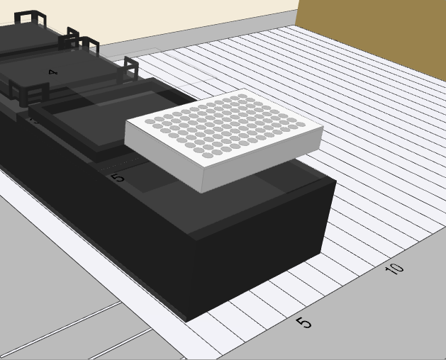

# Command Overview by Step Groups

Command Overview by Step Groups

The VENUS Software offers various standard Command Libraries. For the ML STAR instrument, the software offers three levels of commands which are:

1. **Smart Steps**, which combine a complete pipetting task such as plate copy, serial dilution, pooling etc. Smart Steps are incorporated with customizable error handling which includes a guided programming wizard, predefined error recoveries and customized recovery strategies.
2. **Easy Steps**, which are combinations of e.g. tip pickup and aspiration. Easy steps allow very flexible programming and also include full error handling. However, the sequence support is limited (e.g. for pipetting into all wells of the entire plate, a loop must be added).
3. **Single Step** commands are used when highest flexibility of the system is required. These commands allow even the most complex pipetting and plate handling tasks. However, tip handling and sequence support are not included.

<table data-header-hidden><thead><tr><th width="145"></th><th></th></tr></thead><tbody><tr><td></td><td>
NOTE

After a new installation a reduced selection of steps are available. To make hidden steps available, enable them via the Configuration Editor.
</td></tr></tbody></table>

A detailed description of all commands belonging to the “General Steps” Group in the method editor toolbox window is directly accessible in the software. For more information, refer to the Help Menu.

General Steps

<table><thead><tr><th width="181">Command</th><th>Icon</th><th>Action Performed</th></tr></thead><tbody><tr><td>Comment</td><td> </td><td>For any programmer-defined comments in a method</td></tr><tr><td>Assignment</td><td> </td><td>Initialize a variable with a value</td></tr><tr><td>Assignment with Calculation</td><td> </td><td>Perform basic arithmetical operation</td></tr><tr><td>Loop</td><td> </td><td>Loop commands for start and end of loop will be inserted</td></tr><tr><td>Loop Break</td><td> </td><td>Unconditional loop termination</td></tr><tr><td>If, Else</td><td></td><td>Conditional command</td></tr><tr><td>
Array:

Declare / Set Size
</td><td> </td><td>Define the type and the size of the array (1-based)</td></tr><tr><td>Array: Set at</td><td> </td><td>An element within an array is set at a given index (1- based)</td></tr><tr><td>Array: Get at</td><td> </td><td>Get the value of an array-element at a given index (1- based)</td></tr><tr><td>Array: Get Size</td><td> </td><td>Get the number of elements (1-based)</td></tr><tr><td>Array: Copy</td><td> </td><td>Copy all elements of an array to another (1-based)</td></tr><tr><td>
Sequence:

Get current position
</td><td> </td><td>Get current position (the next available position in a sequence)</td></tr><tr><td>
Sequence:

Set current position
</td><td> </td><td>Set current position</td></tr><tr><td>
Sequence:

Get end position
</td><td> </td><td>Get end position</td></tr><tr><td>
Sequence:

Set end position
</td><td> </td><td>Set end position</td></tr><tr><td>
Sequence:

Adjust sequences
</td><td> </td><td>Adjust sequences (Adjust all given sequences to the length of the shortest one)</td></tr><tr><td>File: Open</td><td></td><td>Open a file before file access</td></tr><tr><td>File: Read</td><td>
 

</td><td>Read data out of a file</td></tr><tr><td>File: Write</td><td>
 

</td><td>Write data into a file</td></tr><tr><td>
File:

Set position
</td><td>
 

</td><td>Set the file-pointer to a specific position</td></tr><tr><td>File: Close</td><td>
 

</td><td>Close a file after file operation</td></tr><tr><td>Timer: Start timer</td><td>
 

</td><td>Start a timer</td></tr><tr><td>Timer: Wait for</td><td>
 

</td><td>Wait for timer (timeout)</td></tr><tr><td>
Timer:

Read elapsed time
</td><td>
 

</td><td>Read elapsed time from a started timer</td></tr><tr><td>Timer: Restart</td><td>
 

</td><td>Restart a timer</td></tr><tr><td>Dialog: User input</td><td>
 

</td><td>Display an input box with one or several lines</td></tr><tr><td>Dialog: User output</td><td>
 

</td><td>Display an output box</td></tr><tr><td>Communication: Open</td><td>
 

</td><td>Open a COM port</td></tr><tr><td>Communication: Read</td><td>

 
</td><td>Read data from a com port</td></tr><tr><td>Communication: Write</td><td>
 

</td><td>Write data to a com port</td></tr><tr><td>Communication: Close</td><td>
 

</td><td>Close an open com port</td></tr><tr><td>Shell</td><td>
 

</td><td>Call external program out of the Hamilton software</td></tr><tr><td>Set Event</td><td>
 

</td><td>Create an event to take place in a parallel process</td></tr><tr><td>Wait for Event</td><td>
 

</td><td>Wait until an event in a parallel process has taken place</td></tr><tr><td>Return</td><td>
 

</td><td>Assign a return value to a sub-method and return</td></tr><tr><td>Abort</td><td></td><td>Abort method</td></tr><tr><td>Error Handling by the User</td><td></td><td>Identify a section with programmer-defined error handling</td></tr><tr><td>Begin parallel process</td><td></td><td>Start a bifurcation for programming parallel processes</td></tr><tr><td>End parallel process</td><td></td><td>End a bifurcation for programming parallel processes</td></tr></tbody></table>

<table><thead><tr><th width="181">Command</th><th>Icon</th><th>Action Performed</th></tr></thead><tbody><tr><td>Comment</td><td> </td><td>For any programmer-defined comments in a method</td></tr><tr><td>Assignment</td><td> </td><td>Initialize a variable with a value</td></tr><tr><td>Assignment with Calculation</td><td> </td><td>Perform basic arithmetical operation</td></tr><tr><td>Loop</td><td> </td><td>Loop commands for start and end of loop will be inserted</td></tr><tr><td>Loop Break</td><td> </td><td>Unconditional loop termination</td></tr><tr><td>If, Else</td><td></td><td>Conditional command</td></tr><tr><td>
Array:

Declare / Set Size
</td><td> </td><td>Define the type and the size of the array (1-based)</td></tr><tr><td>Array: Set at</td><td> </td><td>An element within an array is set at a given index (1- based)</td></tr><tr><td>Array: Get at</td><td> </td><td>Get the value of an array-element at a given index (1- based)</td></tr><tr><td>Array: Get Size</td><td> </td><td>Get the number of elements (1-based)</td></tr><tr><td>Array: Copy</td><td> </td><td>Copy all elements of an array to another (1-based)</td></tr><tr><td>
Sequence:

Get current position
</td><td> </td><td>Get current position (the next available position in a sequence)</td></tr><tr><td>
Sequence:

Set current position
</td><td> </td><td>Set current position</td></tr><tr><td>
Sequence:

Get end position
</td><td> </td><td>Get end position</td></tr><tr><td>
Sequence:

Set end position
</td><td> </td><td>Set end position</td></tr><tr><td>
Sequence:

Adjust sequences
</td><td> </td><td>Adjust sequences (Adjust all given sequences to the length of the shortest one)</td></tr><tr><td>File: Open</td><td></td><td>Open a file before file access</td></tr><tr><td>File: Read</td><td>
 

</td><td>Read data out of a file</td></tr><tr><td>File: Write</td><td>
 

</td><td>Write data into a file</td></tr><tr><td>
File:

Set position
</td><td>
 

</td><td>Set the file-pointer to a specific position</td></tr><tr><td>File: Close</td><td>
 

</td><td>Close a file after file operation</td></tr><tr><td>Timer: Start timer</td><td>
 

</td><td>Start a timer</td></tr><tr><td>Timer: Wait for</td><td>
 

</td><td>Wait for timer (timeout)</td></tr><tr><td>
Timer:

Read elapsed time
</td><td>
 

</td><td>Read elapsed time from a started timer</td></tr><tr><td>Timer: Restart</td><td>
 

</td><td>Restart a timer</td></tr><tr><td>Dialog: User input</td><td>
 

</td><td>Display an input box with one or several lines</td></tr><tr><td>Dialog: User output</td><td>
 

</td><td>Display an output box</td></tr><tr><td>Communication: Open</td><td>
 

</td><td>Open a COM port</td></tr><tr><td>Communication: Read</td><td>

 
</td><td>Read data from a com port</td></tr><tr><td>Communication: Write</td><td>
 

</td><td>Write data to a com port</td></tr><tr><td>Communication: Close</td><td>
 

</td><td>Close an open com port</td></tr><tr><td>Shell</td><td>
 

</td><td>Call external program out of the Hamilton software</td></tr><tr><td>Set Event</td><td>
 

</td><td>Create an event to take place in a parallel process</td></tr><tr><td>Wait for Event</td><td>
 

</td><td>Wait until an event in a parallel process has taken place</td></tr><tr><td>Return</td><td>
 

</td><td>Assign a return value to a sub-method and return</td></tr><tr><td>Abort</td><td></td><td>Abort method</td></tr><tr><td>Error Handling by the User</td><td></td><td>Identify a section with programmer-defined error handling</td></tr><tr><td>Begin parallel process</td><td></td><td>Start a bifurcation for programming parallel processes</td></tr><tr><td>End parallel process</td><td></td><td>End a bifurcation for programming parallel processes</td></tr></tbody></table>

