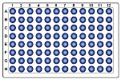
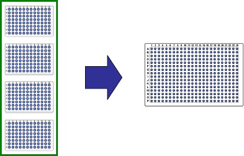

# Sequences

VENUS Software uses sequences for pipetting, transport, tip handling etc.

A sequence is a list that specifies the order of execution. A sequence contains three columns:

* **Index** - column that identifies each sequence position.
* **Labware ID** - specifies the labware on which the position is defined (e.g. Plate)&#x20;
* **Position ID** - container on which the sequence position is defined (e.g. Well A1) Refer to the example shown below.

Example

<figure><figcaption></figcaption></figure>

 

<figure><figcaption></figcaption></figure>

Almost every action of an instrument needs two sequences: a source and a target sequence. This is true for pipetting from an aspirate to a dispense sequence, when transporting labware from the getPlate sequence to the placePlate sequence, when coupling tips from the pickup sequence and ejecting it to the waste sequence etc.

## Pointers:&#x20;

Every sequence (such as the ones shown below) has three pointers which may change during a run:

• Current position (which is the _next available_ position in the sequence)&#x20;

• End position (the _last position_ to be used)&#x20;

• Total number of elements (the overall length of the sequence)&#x20;

> **Example:**
>
> 
>
> Within the method, all three pointers may be modified or requested through the appropriate functions.\
>

|                                                                                    | A **default sequence** is created automatically when plates or tube racks are placed on the deck. The sorting of these sequences is depending on the selected stamp tool.  |
| --------------------------------------------------------------------------------------------------------------------------------------------------------------- | -------------------------------------------------------------------------------------------------------------------------------------------------------------------------- |
| 

Having for instance, the stamp tool for the CO-RE 96 Probe Head activated, the default sequence will be optimized to be processed with this head.
 |                                                                                               |

Custom sequences can be defined graphically in two ways:

1. By clicking on each appropriate well on the plate or tube rack
2.  By using the rubber band zoom

    In both ways, the current selected “Stamp Tool” is used to sort the added position.

    \

> Example:
>
> On the STAR, an action to aspirate samples from tubes and dispense into microplates in a manner that will be free of contamination – in which case disposable tips will be preferred.
>
> The example describes such a method:
>
> Method:&#x20;
>
> 1. Pick up Tips
> 2. Aspirate from Samples
> 3. Dispense to Plates
> 4. Eject to Waste
>
> 

Definitions&#x20;

• A **Method** describes operations on sequences.&#x20;

• A **Deck Layout** describes the physical positions of labware on the instrument deck.&#x20;

• A **Labware** item describes the geometry of parts which can be dealt with as a whole, such as the wells of a Microplate, or which can be combined on the deck, such as a carrier holding several plates.&#x20;

• A **Sequence** describes the order in which labware positions are to be processed on the instrument’s deck. \

## Advantage of Using Sequences

The advantage of working with sequences is the unrivalled flexibility. VENUS Software obtains the coordinates of the pipetting spots out of sequences.

In an example of a 96-well Microplate and the 8-Pipetting Channel STAR, the default pipetting order is:

\

<table data-header-hidden><thead><tr><th width="156"></th><th width="412"></th><th></th></tr></thead><tbody><tr><td>
1st pipetting: 

2nd pipetting: 

3rd pipetting: 

4th pipetting:

…
</td><td>
A1; B1; C1; D1; E1; F1; G1; H1 ( = column 1) 

A2; B2; C2; D2; E2; F2; G2; H2 ( = column 2) 

A3; B3; C3; D3; E3; F3; G3; H3 ( = column 3)

 A4; B4; C4; D4; E4; F4; G4; H4 ( = column 4)

…
</td><td>

</td></tr></tbody></table>

Because labware is represented by a sequence there is the ability to change the order of the pipetting steps, for example:

* Excluding of complete columns or single wells
* Sorting the pipetting spots by the characteristics of the: x-/y- coordinates, Position ID, etc.

Another advantage of the sequence philosophy is the possibility of merging several sequences like in the case of reformatting four 96-well Microplates to one 384-well Microplate.

Now all of the pipetting spots of the 96-well plates are merged into one sequence.

Only one pipetting step is now needed because of merging the 96-well Microplates to one source sequence.

<figure><figcaption></figcaption></figure>

The programming of the reformatting steps then becomes much easier. Within only one pipetting step, all wells of the four 96-well Microplates can be transferred to the 384-well Microplate.
