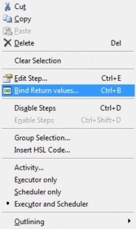

# Variables and Return Values

*   #### _Variables‌_

    \

    _Within a method, the programmer will naturally define and process variables. There are two ways to specify variables:_

    1. _Use the “Assignment / Assignment with calculation steps” from the “General Steps”._
    2.  _Type in the variable and the value needed and confirm with \[OK]._

        \

        

        \

    3. _Activate the “Variables and Constants” Screen shown below in the “View  Variables” Menu or with \[ALT + F7]._
    4.  _To create a new variable, trigger the Context Menu with a right click in the Variables and Constants scree, and select “New”._

        \

        
    5.  _Type in the name, type, scope, start value and the description (optional). Confirm the entries with \[OK]._

        \

        

        \

    6.  _The new variable is now available in the method._

        \

        _The method editor supports three kinds of variables with differing scope:_

        \

        | Local variables:      | Valid only within a sub-method. All variables declared inside a sub-method automatically have a local scope. Local variables can be promoted to “Task local variables” through the “Method Export local variable” Menu.                                                                                                                                                                                                            |
        | --------------------- | ----------------------------------------------------------------------------------------------------------------------------------------------------------------------------------------------------------------------------------------------------------------------------------------------------------------------------------------------------------------------------------------------------------------------------------- |
        | Task local variables: | Valid within a method. All sub-methods have access to variables of this type. Local variables and Task local variables with identical names can coexist however, it is recommended to use naming conventions or prefixes. Such variables are generated when they are declared within the main program, or for example, within the method. When the method is scheduled, each task will have its own task local variable.            |
        | Global variables:     | 
Can be accessed by all tasks using a method (see the Scheduler Manual). They can be declared in the Method Editor through the “Method  Global variables” Menu. This menu option can also promote a Task local variable to a global variable.

If a workflow contains a task local variable and a global variable with the

same name, a name conflict occurs. In this case, a syntax error hint will be signaled.
 |

        

        _NOTE_

        _It is important to avoid mixing and confusing local and global variables. If possible, use naming conventions allowing the identification of each variable type:_

        _GV\<variable name> for global variables used for all tasks of the same method_

        _TV\<variable name> for task local variables used in one method_

        _LV\<variable name> for local variables used in a sub-method_

        _It is not possible to define variables which are valid in a method without being also valid in the related sub-methods. For this requirement, define task local variables with reserved names, e.g.:_

        _MLV\<variable name> for local variables used in a method._

        \

        _The Graphical Method Editor provides variables which can accommodate three sub-types of variables without explicit declaration:_

        * _Integers (numbers)_
        * _Floats (floating point numbers)_
        *   _Strings (text variables and characters)_

            _Variables can be newly defined within the dialogs, if they occur in the following:_
        * _Left-hand side of an equation (e.g. x=0, or x=t+1), or_
        * _Within entry fields that hold only one variable_

        _If not requested (as it is the case for the “Open File” Dialog), the variable types are identified automatically. For example, f=5 will generate a variable f of type integer._

        \

        

        _NOTE_

        _To define a string (text) variable through the assignment step, the text must be enclosed in quotation marks, e.g. “s” = “Test”. The variable “s” is then of type string. Otherwise, the contents of a variable named “Test” and its contents will be assigned to s. If the “Test” variable does not exist, a warning will be prompted._

        \

        

        _Variables once defined show up in the drop-down list of all input fields of a method. Syntax_

        _For variable names, do not_

        _− place numbers at the beginning_

        _− use blanks or signs other than the underscore (“”) Variable names are case-sensitive._

        _To define a path within a string variable in the course of programming, use the double backslash (“\”) - e.g. “c:\programfiles\hamilton\methods\“. To define a path at run time by typing it into an input box, use single backslash (“\</b>“). The reason for this is that variables defined in the course of programming are analyzed for escape sequences (for example single backslash “\</b>”), and single backslash followed by n (““) means “new line”._

        \

*   #### _‌Return Values‌_

    \

    _Often times, the steps used will return data when the step is executed. A typical example would be a mathematical function, like a simple assignment x=0._

    _Dialog functions or instrument steps can also return data:_

    * _Dialog functions will provide a code of the button pressed upon exit enabling the method to continue depending on the button pressed in a particular dialog._
    * _Instrument steps can, for example, return a temperature for the TCC (Temperature- Controlled Carrier) or a pressure value for the BVS / CVS._

    \

    _Example 1 (Function Call)_

    _Using the "Round" Function of the HLSMth library leads to the dialog below showing an entry field "Bind return value to:" which by default is empty. Select a variable listed in the dropdown list or enter a variable name, even one that does not yet exist. Leaving this field empty means that there is no variable where the rounded value of NumberOfCycles\_Float will be taken from._

    \

    

    _Example 2 (Instrument Step Return Values)_

    _In a similar way you can have access to the additional return value of, for example, the "GetTemperature" Function of the TCC. Some functions return more than one item of information._

    _If you use this "GetTemperature" Function, you will only be asked for the TCC you want to use. The value of interest, the returned temperature, needs to be bound in a separate task._

    _To do this perform these steps:_

    1. _Right-click on the desired step._
    2. _Select "Bind Return values..." from the Context Menu that opens._

    \

    | 
 

 | The “Bind Return values…” Function is also available as a function button in the toolbar. The function is active for method steps which have additional return values. |
    | -------------------------------------------------------------------------- | ---------------------------------------------------------------------------------------------------------------------------------------------------------------------- |

    \

    

    _NOTE_

    _The “Easy Steps” and “Smart Steps” do not have the “Bind Return values…” Function._

    \

    _These pieces of information as presented in the image below can be stored in variables for further processing or to be used as output. The dialog generally lists the return values, each with an editable field “Variable Name”, to define the variable the return value is to bound to._

    \

    
*   #### _‌When to Bind Variables‌_

    \

    _It is up to the programmer to choose whether to bind variables or not. Often times, the variables need to be handled in a different way from what are shown in the examples. For user defined error handling, there is a necessity to bind return values._

    _Functions with additional return values which have to be bound by the procedure, as shown above can be simply recognized in a method. The number of return values is given, even if it is not going to be handled (see in the topmost label of method 2, "Tip Pick Up" in the image below). The return value(s) assigned to the variables will also be shown (see the method Steps 3 and 4 in the image below)._

    \

    

