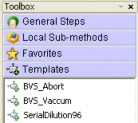
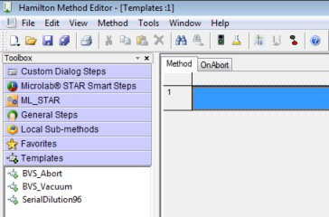
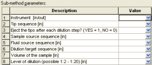
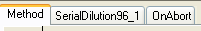
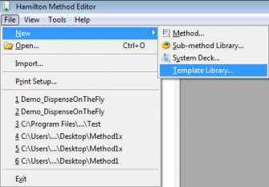
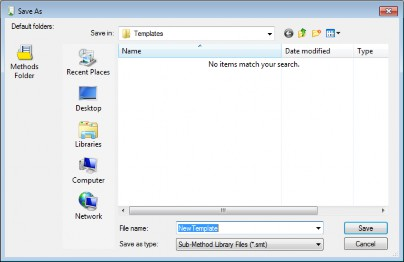

# Using Templates

“Templates” offer a framework for commonly used method parts. This shortens the programming time immensely since the programmer does not have to start from scratch. Templates and sub- method libraries within a method are treated similarly.

<figure><figcaption></figcaption></figure>

A “Templates” or “Toolbox Templates” Tab is available. This is where the existing templates can be found.

<table data-header-hidden><thead><tr><th width="145"></th><th></th></tr></thead><tbody><tr><td></td><td>
NOTE

Templates are not part of the basic installation of VENUS Software. They have to be added after the installation of VENUS Software.
</td></tr></tbody></table>

## Including Templates‌

Templates have to be stored in the folder C:\Program files\HAMILTON\Library\Templates (the non-bold sections of the path may differ if a different language is in use).

<table data-header-hidden><thead><tr><th width="145"></th><th></th></tr></thead><tbody><tr><td></td><td>
NOTE

For the availability of templates, please consult a local Hamilton Representative.
</td></tr></tbody></table>

## ‌Using Templates‌

After the templates have been copied to the …/HAMILTON/Library/Templates folder, they will now be visible in the “Templates” or “Toolbox Templates” Tab found in the Toolbox on the left side of the window when opening/creating a method.

To use a template, drag it from the toolbox onto the method.\

<figure><figcaption></figcaption></figure>

\

If a template is using parameters, the parameter window opens and can be filled (this is very similar to the use of sub-methods / sub-method libraries).&#x20;

The example below shows the parameter window of the serial dilution template, where the instrument, sequences, volumes and the concentration have to be defined.

<figure><figcaption></figcaption></figure>

After entering all necessary parameters and closing the window, the system will generate a “Sub- method” Tab in the method editor (see below) and include the sub-method steps to the new sub- method.

<figure><figcaption></figcaption></figure>

\

If the template is fulfilling all requirements, no further changes are necessary. Finish the method programming.

## Programming Templates‌

There are different ways to create a template.

1.  The easiest one is through the “File -> New -> Template Library” Menu.\

    <figure><figcaption></figcaption></figure>
2. Save the new template with a relevant name. Confirm with \[Save].

<figure><figcaption></figcaption></figure>

\

## ‌Changing Templates‌

There are two ways to change a template:



If the templates steps need modification, just click on the Template’s Tab in the method. This switches to the e.g. SerialDilution96\_1 steps. Here, all necessary changes can be made to completely fulfill all the requirements. For example, an aspiration of a sample can be modified with a mix step.

<table data-header-hidden><thead><tr><th width="145"></th><th></th></tr></thead><tbody><tr><td></td><td>
NOTE

Changes made in the method under the Template’s Tab are only valid for the particular template.
</td></tr></tbody></table>

It is also possible to add the same template several times into the same method. This could be the case when e.g. two serial dilutions with different steps are needed in the same method. The templates include an index as a suffix (see below) as an indicator so that each template can be adapted according to the customer’s needs.

<figure><figcaption></figcaption></figure>



If a template should be changed to reduce the adaption work in every method, open the original Template file in the C:\Program Files\HAMILTON\Library\Templates folder. This folder is where the original Template files are stored. The Templates can be opened and modified from here. After applying the necessary changes, save the new version and open up a method to include the new version.

<table data-header-hidden><thead><tr><th width="145"></th><th></th></tr></thead><tbody><tr><td></td><td>
NOTE

Changing an original template file will have no effect on the previously included templates. 

Only the newly added templates will contain the changes made in the original file.e method under the Template’s Tab are only valid for the particular template. All following includes will then contain the changes made on the template.
</td></tr></tbody></table>



##
