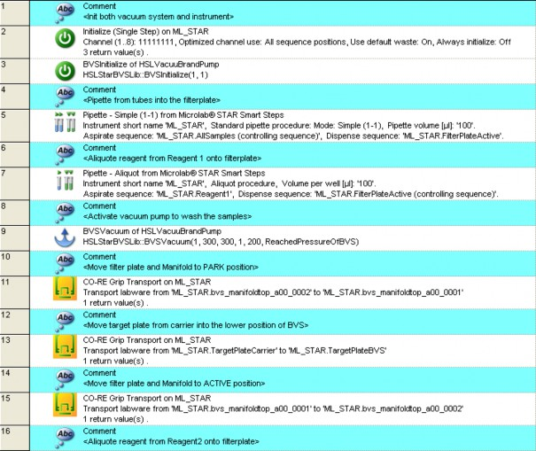
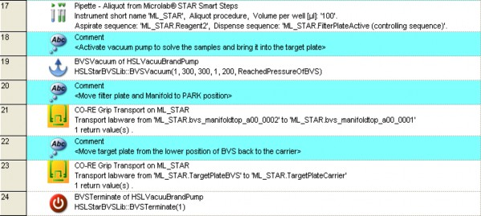

# Basic Vacuum System (BVS) / Crystal Vacuum System (CVS)

_The CVS (Crystal Vacuum System) consists of a seven-track-wide carrier with a vacuum manifold, a park position for the manifold top and two plate positions. The rear Microplate position can be replaced by a Hamilton Heater Shaker._

_The vacuum is generated with a pump, for example from Vacuubrand, which can be controlled by the VENUS Software._

_The manifold top can be handled either by the iSWAP or the CO-RE Gripper. If the iSWAP are used for these movements, four tracks next to the BVS / CVS carrier have to be empty, usually on the right side._

_For more details about the CVS, refer to the ML STAR Line Operator’s Manual._

<table data-header-hidden><thead><tr><th width="145"></th><th></th></tr></thead><tbody><tr><td></td><td>
<em>NOTE</em>

<em>BVS and CVS are similar and need the same programming steps but different labware. If it is not certain which labware is at hand, teach the position inside the active position to avoid step losses during plate transports.</em>
</td></tr></tbody></table>

## _Command Description‌_

_The commands for the BVS / CVS are functions of the additional library “HSLVacuuBrandPump.hsl”. To make the library functions available, install the library through “Tools -> Hamilton Support Software...“._

_The following commands are integrated in the “HSLVacuuBrandPump” Library:_

_The commands control only the VacuuBrand vacuum pump of the BVS / CVS - the vacuum pump itself and the air admittance valve. The controlling of the vacuum system runs in the background, independently from the method. This means that there is no need to create a parallel task. The only thing to do is to set the transport steps to and from the BVS / CVS and the transport of the manifold._

_There are two libraries combined under one library tab: The old HSLVacuuBrandPump library (Low Level Steps) and the new HSLStarBVSLib (High Level Steps)._

### StarBVSLib: (recommended – HIGH LEVEL FUNCTIONS)

| Command               | Icon                                                                        | Action Performed                                                                                  |
| --------------------- | --------------------------------------------------------------------------- | ------------------------------------------------------------------------------------------------- |
| BVSAbort              | 
 

 | This function is used to stop all pump units and shut down their connections in an abort handler. |
| BVSGetAmbientPressure | 
 

 | Returns the ambient pressure measured with the specified pump unit.                               |
| BVSGetSimulationMode  | 
 

 | Returns whether simulation mode is set for the specified BVS or not.                              |
| BVSInitialize         | 
 

 | This function initializes the connection to the specified BVS.                                    |
| BVSSetSimulationMode  | 
 

 | Sets the specified BVS to simulation mode.                                                        |
| BVSTerminate          | 
 

 | This function closes the connection to the specified BVS.                                         |
| BVSTrack              | 
 

 | Tracks a BVS volume move to the vector database.                                                  |
| BVSVacuum             | 
 

 | Runs the vacuum process on the specified BVS.                                                     |
| BVSVacuumTrack        | 
 

 | Runs the vacuum process on the specified BVS. The volume move is tracked to the vector database.  |

### HSLVacuuBrandPump: (older – LOW LEVEL FUNCTIONS)

| Command                   | Icon                                                                        | Action Performed                                                                                                                                                      |
| ------------------------- | --------------------------------------------------------------------------- | --------------------------------------------------------------------------------------------------------------------------------------------------------------------- |
| Initialize                | 
 

 | Initializes one of up to four pumps on a RS232 COM port.                                                                                                              |
| Terminate                 | 
 

 | Closes connection of a selected pump.                                                                                                                                 |
| Request actual pressure   | 
 

 | Requests pressure of a selected pump.                                                                                                                                 |
| Open Air Admittance Valve | 
 

 | Opens air-bleed valve at a selected pump.                                                                                                                             |
| Start Pressure Control    | 
 

 | Starts pressure control for a desired duration and, after timeout, open the air-bleed valve for a desired time if necessary.                                          |
| Wait For Pump Stopped     | 
 

 | Waits for the termination of the “Start Pressure Control” Command.                                                                                                    |
| Stop Pump Immediate       | 
 

 | Stops a running “Start Pressure Control” Command immediately. The air-bleed valve will be opened. This command is provided for emergency cases (e.g. error handling). |

## _‌Integration of BVS / CVS‌_

_The labware for the CVS carrier can be downloaded from the Resource Center. The labware for the BVS / CVS carrier is saved in the folder “ML STAR CVS”. Three definitions are predefined for BVS / CVS carriers:_

* _with no shaker_
* _with one shaker on position 1_
* _with one shaker on position 2_

_No labware is preloaded on the vacuum system carriers._

<table data-header-hidden><thead><tr><th width="145"></th><th></th></tr></thead><tbody><tr><td></td><td>
<em>NOTE</em>

<em>Three different versions of vacuum systems exist. All versions need the same programming steps, but different labware. If it is not certain which labware is at hand, teach the position inside the active position to avoid step losses during plate transports.</em>
</td></tr></tbody></table>

_The z-position within the active position of the vacuum system is shown with different levels. See image below._

| Plate on position 7                                                  | Plate on position 8                                                      |
| -------------------------------------------------------------------- | ------------------------------------------------------------------------ |
|  |  |

\

_Use the zooming and rotating functions to position the labware in a correct level._

\

_Use the “Search Labware” Text Field to display all BVS carriers. Select the desired one._

### _Creating the Deck Layout_

_Add the following labware to the Deck Layout:_

* _A tip carrier “TIP\_CAR\_480\_HT\_A00” on the deck_
* _Three sample tube carriers “SMP\_CAR\_32\_12x100\_A00”_
* _The BVS vacuum system “BVS\_Shaker0\_A00” to the deck_
* _A reagent carrier “RGT\_CAR\_3R\_A01\_0001” (troughs named “Reagent1”, “Reagent2”)_
* _A plate carrier for Deep Well Plates “PLT\_CAR\_L5AC\_A00”_
*   _The ”COREGripTool\_AtWaste\_1000ul” on the waste block_

    \

    _The following plates are needed:_
* _Corning\_96\_Filter on position 7 (Top) of the BVS. Name it ‘FilterPlateActive’_
*   _Cos\_96\_RD in position 8 of the BVS on the ‘Bottom’ position, named ‘TargetPlateBVS’_

    
* _The same Cos\_96\_RD in position 5 of the plate carrier, named ‘TargetPlateCarrier’ The deck should like the image presented below._

### _Creating the Sequences_

_In addition to the default sequences, only one sequence over all three sample carriers named “AllSamples” is needed._

_Creating the Method_

_The method for the BVS / CVS should look like the image shown below:_

<figure><figcaption></figcaption></figure>

<figure><figcaption></figcaption></figure>

Method Steps Explained

### _STEP 1:_&#x20;

Initialization of the instrument and the VacuuBrand pump.\

### STEP 2

_Pipette samples from tubes into the filter plate on the manifold._\
_Make sure that the dispensing details settings in step 5 of the Smart Step are set as shown below._\
\
_The final sequence manipulation is now used to reset the filter plate sequence back to the start point (current = 1)._\
.png>)\

### _STEP 4:_&#x20;

_Aliquote reagent 1 over all filter plate positions._\

### _STEP 5:_&#x20;

_Activate the vacuum pump to wash the samples._\
.png>)\
\
**PumpID:** The id of the vacuum pump. Having more than one pump, count up from 1. \
\
**DeltaPressure:** The negative pressure in millibar, calculated from ambient pressure. \
\
**Duration:** The time of the vacuum action in seconds. \
\
**OpenValve:** 1 opens the valve after the duration, 0 leaves the valve closed so that the pressure is kept in the vacuum chamber. \
\
**ThreshPressure:** This is the limit at which the system will indicate the vacuum action as OK (e.g. ambient pressure was read 900 mbar, delta pressure is set to 300 (that means down to 600 mbar) and the threshPressure is set to 200 (that means 700 mbar). If the system is able to reach the threshPressure, the action will be stated as OK. \
\
**ReachedPressure:** Here, a variable that holds the value of the deepest pressure reached during this run (to write in the trace file or for your own decisions within the method) can be inserted. For the steps that follow, refer to the method presented in the preceding two pages\

### _STEP 6:_&#x20;

_Moves the manifold with the filter plate to the PARK position of the BVS using CO-RE Grip._

### _STEP 7:_&#x20;

_Moves the target plate from the plate carrier into the lower position of BVS, with the CO- RE Grip._

### _STEP 8:_&#x20;

_Moves the manifold with the filter plate back to the ACTIVE position of the BVS._

### _STEP 9:_&#x20;

_Aliquots the solving reagent from the ReagentCarrier onto the filter plate. This is used to solve the samples from the filter so they can be transferred to the target plate underneath the filter plate. Copy step 4 and change the aspirate position._

### _STEP 10:_&#x20;

_Vacuum action to bring the samples from the filter plate in the TargetPlate. Copy step 5 and change the duration to 300 seconds._

### _STEP 11 & 12:_

&#x20;_move the manifold to the park position (copy step 6) and bring the target plate back to the plate carrier._

### _STEP 13:_

_will finally terminate the connection between the vacuum pump and PC._

## Activating BVS / CVS Maintenance

Activation of BVS / CVS maintenance requires the source files “HslStarLineMaintMetConst.hs\_” and “HslStarLineMaintMetConst.stp”. These files can be found in the …\HAMILTON\Library Folder.&#x20;

The files can be modified individually by following the instructions below:&#x20;

1. Make a copy of the “HslStarLineMaintMetConst.hs\_” HSL file.&#x20;
2. Modify the value of the constant “isBVSInstalled(hslFalse);” to “isBVSInstalled(hslTrue);”.&#x20;
3. Save the file.&#x20;
4. After checking the syntax, the same file with an extension of “.stp” will be attained.&#x20;
5. Rename the original files to something similar to “old\_ HslStarLineMaintMetConst.hs\_” and “old\_ HslStarLineMaintMetConst.stp”.
6. Finally rename the files that have been generated to the original names.

\
