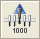
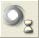

# ‌CR Needle Wash Station‌

*   ### _‌Needle Washing Using the CR Needle Wash Station‌_

    \

    _In combination with a wash station, re-usable steel needles can be used for pipetting with the spreadable 1000μl-pipetting channels of the ML STAR, instead of using the disposable tips. The result of washing needles depends on the wash setting._

    \

    

    _NOTE_

    _If carry-over is not acceptable for the application, use new disposable tips for each aspiration step instead of washed steel needles._

    \

    _The picture shows a completely hooked-up CR needle wash station:_

    \

    

    1. _CR Washer Unit_
    2. _b) Pump Unit A and Tubing_
    3. _Waste Container (one)_
    4. _Wash Solution Containers (two)_

    \

    _a)_

    \

    _c) d)_

    \

    _The wash cycle of the CR needle wash station works in parallel to the pipetting steps. Liquid level sensors in the containers recognize whether the wash solution is used up or if the waste bottle is full. During run time, a message box is displayed giving the opportunity to refill/empty the containers._

    \

*   ### _‌Command Description‌_

    \

    _The following tables in this section give a brief overview of the available commands for the CR needle wash station._

    1.  #### _‌Single Steps‌_

        \

        | Liquid Handling                     |                                                                                                          |                                                                                  |
        | ----------------------------------- | -------------------------------------------------------------------------------------------------------- | -------------------------------------------------------------------------------- |
        | 1000µl-Pipetting Channel            |                                                                                                          |                                                                                  |
        | Command                             | Icon                                                                                                     | Action Performed                                                                 |
        | 1000μl Channel Tip Pick Up          | 
 

                              | Picks up a CO-RE tip or needle.                                                  |
        | 1000μl Channel Start Needle Wash    | 
 

   | Starts a needle wash module.                                                     |
        | 1000μl Channel Wait For Needle Wash | 
 

 | Waits for the needle wash module to be ready.                                    |
        | 1000μl Channel Tip Eject            | 
 

                              | Discards the tip into the tip waste or the needle into the wash station or rack. |

        \

        

        _NOTE_

        _It is recommended to use the “SmartStep Needle Pickup”. If the “1000μl- Channel Tip Pick Up” Single Step is used, a “1000μl Channel Wait for Needle Wash” Step has to be programmed before the tip pick up step._

        _With the Easy Step ASPIRATE, the needle pick up is also possible._

        _With the Easy Step DISPENSE, needle eject and start washing is also possible._

        \

    2.  #### _‌Smart Steps‌_

        \

        _The needle wash step is embedded in the “Needle Eject” Command._

        \

        | ML\_STAR Smart Steps          |                                                                                                           |                                           |
        | ----------------------------- | --------------------------------------------------------------------------------------------------------- | ----------------------------------------- |
        | Command                       | Icon                                                                                                      | Action Performed                          |
        | 1000μl Needle Wash Settings   | 
 

 | Sets Wash Parameters.                     |
        | 1000μl Channel Needle Pick Up | 
 

                               | Picks up a needle.                        |
        | 1000μl Channel Needle Eject   | 
 

                               | Ejects the needle for (optional) washing. |
*   ### _‌Programming the CR Needle Wash Station‌_

    \

    _Below is a simple example of a method showing how to program the CR Wash Station using the Smart Steps. This method will wash all three sets of needles in the wash station. This could be useful after the instrument was not used for a long time._

    1.  _First, activate the wash station in the System Configuration Editor. Please note that this entry will work globally for all methods. If the method does not use a wash station, it can also be switched off here._

        \

        

        \

    2. _The method requires the following Deck Layout:_

    \

    

    _Creating the Deck Layout_

    1.  _Create a new method called DemoWashStation.med._

        \

        

        \

    2. _Switch to the “Labware” Tab and add the search string “Wash high” to the “Search Labware” Field. The system will filter out everything except the two possible wash stations. Select the “Car\_Wash\_1\_CR\_HighNeedle\_A00” Carrier for the wash station and drag it onto the deck. Refer to the image below._

    \

    

    \

    _Creating the Sequences_

    _Create one sequence over all three wash blocks and name it “AllHighNeedles”._

    \

    _Creating the Method_

    _The resulting method should look like this:_

    \

    

    1. _Define the wash settings using the “Needle Wash Settings” Smart Step (line 2)._
    2.  _This table shows default values of the wash parameters for 1000µl, 300µl and 10µl-volume needles._

        \

        | Needle  | Rinse time | Soak time | Flow rate    | Draining time |
        | ------- | ---------- | --------- | ------------ | ------------- |
        | 10 µl   | 5 seconds  | 5 seconds | 16 ml/second | 10 seconds    |
        | 300 µl  | 5 seconds  | 5 seconds | 15 ml/second | 10 seconds    |
        | 1000 µl | 5 seconds  | 5 seconds | 11 ml/second | 10 seconds    |

        \

    3. _Select the wash sequence that shall be used for washing needles. Set all wash parameters and Click \[OK]._
    4.  _Create a loop of 3 iterations (or use the sequence “AllHighNeedles” as the limitation)._

        \

        
    5.  _The next step would be to pick up the needles:_

        \

        

        \

    6. _Please note that the sequence can be selected from the drop down list or by clicking \[Ctrl]. It can be “Drag and Dropped” directly from the Deck Layout._
    7.  _The needle eject dialog box appears as shown:_

        \

        

        \

    8. _Make sure that the “Start wash” Checkbox is ticked. Activating this box will close the wash modules lid right after ejecting and start the washing with the specified parameters._

    \

    

    _NOTE_

    _It is recommended to use the “Needle Pickup” Smart Step. If the “1000μl Channel Tip Pick Up” Single Step is used, a “1000μl Channel Wait for Needle Wash” Step has to be programmed before the tip pick up step._

    _With the Easy Step ASPIRATE, the needle pick up is also possible._

    _With the Easy Step DISPENSE, needle eject and start washing is also possible._

    \

    _The error settings are similar to those of the “Pipette” Smart Step._
