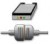

# Hamilton Heater Shaker

## _Hamilton Heater Shaker‌_

\

_The Hamilton Heater Shaker (HHS) is designed to heat and/or shake standard Microplates in SBS format._

[_To operate the HHS, a specific library is required. The maximum shaking speed depends on the labware used. For details, see_ ](hamilton-heater-shaker.md#bookmark338)[_Section_ ](hamilton-heater-shaker.md#bookmark338)_11.12.23_[_HHS_ ](hamilton-heater-shaker.md#bookmark338)_Library. Shaking can be performed clockwise or counter-clockwise._

_Before the heating or shaking is started, the plates are locked and positioned in the center of the HHS. When heating or shaking has been finished, the plates are unlocked and can then easily be removed from the HHS._

_The HHS can be heated to temperatures up to 105°C. The temperature is constantly measured by two sensors, one located in the middle and one at the edge of the adapter plate._

\

1.  ### _‌Programming the Hamilton Heater Shaker‌_

    \

    _The following two examples demonstrate the use of the HHS._

    _Before using the HHS, a connection and device number has to be generated. After the connection has been established, the heater shaker will be initialized._

    _The library offers two commands for this task, depending on the kind of connection determined by the hardware. For connections made via TCC, use the “CreateStarDevice” Command (used for connecting 1 or 2 heater shakers); otherwise use the “CreateUSBDevice” Command. In both cases, a device number is generated that can be stored in a variable. This variable must be used in all other commands of the library to control the heater shaker._

    \

    | Library Function |                                                                             |                                                                                                               |
    | ---------------- | --------------------------------------------------------------------------- | ------------------------------------------------------------------------------------------------------------- |
    | Number of HHS    | Icon                                                                        | Action Performed                                                                                              |
    | 1 – 2            | 
 

 | 
Create Star Device

(Establish a connection to 1 or 2 shakers connected via TCC)
                  |
    | 1 – 8            | 
 

 | 
Create USB Device

(Establish a connection to up to 8 heater shakers using the heater shaker box)
 |

    \

    

    _NOTE_

    _It is required to establish a connection to all heater shakers that will be used in the method. If, for example, only two out of four shakers have been initialized, only these two shakers can be started using the “StartAllShaker” Function._

    

    _NOTE_

    

    _The VENUS Help Function contains a description of all functions of the heater shaker library with a description of parameters passed to the functions or obtained by them. The help documentation can be_

    _accessed by clicking on the yellow question mark within the dialog windows:_

    \

    1.  #### _‌Example 1: Controlling One Hamilton Heater Shaker‌_

        \

        _In this example, a single heater shaker is connected via the ML STAR instrument TCC connector. The heater shaker is heated to 65°C followed by 10 mins shaking at 200 rpm. A detailed description of all the steps can be found in the following section._

        \

        

        _Overview of a method to run the heater shaker at 200 rpm for 10 minutes at 65°C_

        1.  _‌Step by Step Analysis of Example 1_

            \

            _Step 1: Create a connection to the shaker through the “CreateStarDevice” Command. The node can be “1” or “2” if the heater shaker is connected via TCC. The device number can be assigned, which is generated by this command, to any variable of choice. This variable has to be used for all subsequent commands regarding the control of the heater shaker._

            \

            

            \

            

            _NOTE_

            _When inserting a step in the method for the first time, on the toolbar, the “New” Add-on is imprinted._

            \

            

            _If there has been already a method inserted, when editing, the add-on “Edit” is imprinted._

            \

            

            _Step 2: Use the variable containing the device number to access the correct heater shaker. Set the temperature to 65°C. If the “waitForTempReached” Option is chosen with the setting “1”, the method will pause at this step until the defined temperature has been reached and is stable for 180 seconds. Only then the method will continue to the next step. If a pause to the method is not wanted but rather carry out other tasks in parallel to the heating process, the “waitForTempReached” should be set to “0”. At a later time, the temperature can be checked and if necessary, wait for the heating process to finish using the “WaitForTempCtrl” Command._

            \

            

            \

            _Step 3: Here, the shaking parameters, shaking speed and duration of shaking can be set. The speed is defined in rpm and the time in seconds. The shaking speed ranges from 30 rpm to 2500 rpm. The maximum speed depends on the orbit and adapter of the shaker and must not exceed the maximum given in the “Technical Specifications” (Please refer to the Technical Specifications in the ML STAR Line Operator´s Manual). Any function to start shaking will also close the plate lock automatically._

            \

            

            _Step 4: This command will wait until the shaker defined by the device number has finished the timed shaking process. If the shaker is already finished before this function is called, the method will immediately proceed with the next step. This function will also open the plate lock._

            \

            

            \

            _Step 5: As heating is controlled independently from shaking, the heating process has to be terminated explicitly. Otherwise, the heater shaker will continue heating even if it is not used anymore._

            \

            

            _Step 6: If the heater shaker will not be used any longer, the connection can be terminated. At the end of a method or upon abort, the connection is automatically terminated and will stop heating as well as shaking. The plate lock will then open._

            \

            

            \

            

            _The figure above shows a schematic view of the heating and shaking process of Example 1._
    2.  #### _‌Safety Measures Upon Method Abort‌_

        \

        _As soon as the method is aborted, the heater shaker will automatically be stopped. This implies that the heating and shaking process is stopped. The plate lock is opened and the connection to the heater shaker is terminated. No further precautions within the submethod “OnAbort” are required._

        \

    3.  #### _‌Example 2: Controlling Multiple Hamilton Heater Shakers‌_

        \

        _This example shows the usage of multiple heater shakers via USB and the heater shaker box. The connection via USB and HSB is needed in order to control more than two heater shakers. The method is using three heater shakers with different temperature settings._

        \

        

        1.  _‌Step by Step Analysis of Example 2_

            \

            _Step 1-3: Create a connection to all heater shakers to be used in this method using the function “CreateUSBDevice”. It is required to initialize each shaker individually in order to create a device number and to control the heater shaker throughout the method. Heater shakers that are not initialized cannot be started with the “StartAllShaker” Function._

            _The usedNode can range from 1 to 8, depending on the number of heater shakers in use. Node 1 corresponds to the master heater shaker._

            _The deviceNumber is stored in a variable, which is needed to control the heater shaker in all subsequent functions._

            \

            

            \

            _Step 4-6: Set the temperatures for each individual heater shaker, for example to 50°, 60° and 70°C as shown below. If working with several heater shakers, the option “waitForTempReached” has to be set to “0” so that all shakers are heated in parallel._

            \

            

            _Step 7-9: Wait until all heater shakers have reached the set temperature before proceeding to the next step._

            \

            

            \

            _Step 10-12: The “SetShakerParameter” function can be used to change the shaking direction or acceleration of the heater shaker. Usually, the default settings can be used. The default settings are clockwise shaking and an acceleration of 1250. The shaking direction can be changed by entering “1” for counter-clockwise shaking. The value for the acceleration (shakingAccRamp) ranges from 630 to 125000. The default setting of 1250 matches up the acceleration from 0 to the maximum speed of 2500 rpm within two seconds._

            \

            

            _Step 13: All shakers can be started in parallel. Here, the shaking speed is set to 2000 rpm. This function will automatically close the plate lock on all shakers._

            \

            

            \

            _Step 16: To finish shaking of all shakers at the same time use the “StopAllShaker” Function. This function does not require any device numbers but will stop all initialized shakers and will automatically open the plate lock._

            \

            

            _Step 17-19: The temperature control of the heater shaker can be terminated after its usage. If the temperature control is not stopped, heating will continue even after terminating the shaking process._

            \

            

            \

            _Step 20: The connections to the heater shakers are terminated. This step can be omitted at the end of a method, since the connections to all heater shakers are anyway automatically terminated at the end of a method or upon abort of a method._

            \

            
    4.  #### _‌Monitoring the Performance of the Hamilton Heater Shaker‌_

        \

        _For some applications, it might be desirable to monitor the performance of the heater shaker. The library offers the possibility to monitor the shaking speed and temperature during an application. The status of the heater shaker is continuously written to the trace file. The settings for the monitoring can be adjusted within the functions “BeginMonitoring” and “SetTempParameter”._

        _Within the function “BeginMonitoring” the intervals can be defined, like how often the performance of the heater shaker will be checked and the deviation from the set shaking speed that will be tolerated. Choosing which action will be taken if monitoring reports an out of range measurement is also possible._

        _All settings regarding the temperature control have to be made within the function “SetTempParameter”, although the default settings are usually already sufficient._

        _After monitoring, the return value from the function “EndMonitoring” can be examined. The function reports whether heating or shaking or both were out of range._

        \

        

        _ATTENTION_

        _Placing a cold plate on the hot heater shaker will cool down the heater shaker so that the temperature might fall below the defined tolerated temperature range. In this case, the “BeginMonitoring” Function will return an error even if heating is working correctly._

        _To avoid this kind of error, the “StartTempCtrl” Function has to be used immediately before the transport step. This results in heating the heater shaker again until the temperature is stable for 3 min. Monitoring is paused during the “StartTempCtrl” Step._

        \

        _The image below is an example of the monitoring function._

        \

        
