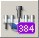

# Wash Station 96/384‌

_The Wash Station 96/384 is an optional device for washing 96/384 disposable tips in parallel. The tips are washed both outside and inside at the same time: on the outside in the wash chambers of the wash station and on the inside by aspiration/dispense cycles using the CO-RE 96 Probe Head / TADM or the CO-RE 384 Probe Head. The result of washing the tips depends on the wash setting._

\

_NOTE_

_If carry-over is not acceptable for the application, use new disposable tips for each aspiration step._

\

_Sample transfers can be done using new disposable tips, while reagents, buffers, etc. can be distributed with washed tips._

_The picture below shows a complete, hooked-up wash station 96/384:_

\

1. _a) Washer unit 96/384_
   1. _Pump unit H and tubing_
   2. _Waste container_
   3.  _Wash solution containers_

       \

       _a)_

       \

2. _d)_

\

_Liquid level sensors inside the washer unit prevent flooding of the system. The washer unit recognizes if there is not enough liquid to fill the wash chamber._

\

_NOTE_

_Always empty the waste container when refilling the wash solution container. When re-using washed tips, pipetting precision may increase by a factor of 3._

1.  ### _‌Command Description‌_

    \

    _The table below gives a brief overview of the available commands for the wash station 96/384. Another possibility to wash the tips is given by the basic step commands “CO-RE 96 Head Dispense” / “CO-RE 384 Head Dispense”. In the basic dispense step, the wash function can be enabled via the “Wash tips after dispense” Parameter. The wash parameter can be set through the \[Customize…] Button._

    \

    | Liquid Handling            |                                                                                                           |                  |
    | -------------------------- | --------------------------------------------------------------------------------------------------------- | ---------------- |
    | CO-RE 96 Probe Head        |                                                                                                           |                  |
    | Command                    | Icon                                                                                                      | Action Performed |
    | CO-RE 96 Head Wash         | 
 

        | Wash tips.       |
    | CO-RE 96 Head Empty Washer | 
 

 | Empty washer.    |

    \

    | Liquid Handling             |                                                                              |                  |
    | --------------------------- | ---------------------------------------------------------------------------- | ---------------- |
    | CO-RE 384 Probe Head        |                                                                              |                  |
    | Command                     | Icon                                                                         | Action Performed |
    | CO-RE 384 Head Wash         | 
 

 | Wash tips.       |
    | CO-RE 384 Head Empty Washer | 
 

 | Empty washer.    |

    \

    

    _ATTENTION_

    _The CO-RE 384 Probe Head performs a blow out after the wash steps. The software automatically uses the tip picking up position (tip rack). Therefore do not reload the tip rack of the pick-up position if performing any wash steps._
2.  ### _‌Programming the Wash Station 96/384‌_

    \

    _The following is a simple example on how to program the wash station 96/384 using the Single Steps._

    _Activate the CO-RE 384 Probe Head and the Pump Station 2 in the Configuration Editor:_

    \

    

    \

    _Creating the Deck Layout_

    _The method requires the following Deck Layout:_

    \

    

    \

    _Use the “Search Labware” Field to add the following labware to the deck:_

    * _“CORE384DualWashStation\_HU\_A00”_
    * _“Core 384 Slide Waste”_
    * _“TIP384\_CAR\_1920\_50ul\_A00”_

    \

    _Creating the Sequences_

    _In this example, the default sequences are being used._

    _Creating the Method_

    _The resulting method should look like the image below:_

    \

    

    _The step in line 1 initializes the instrument._

    _In step 2, the tips are picked up from the tip carrier (sequence counting = “Manually”)._

    \

    

    \

    1.  _Use the “CO-RE 384 Head Wash” Wash Step without modifying the default values. These values guarantee and are the basis for good wash results._

        \

        
    2. _Eject the tips. Use “Eject on tip pick up position” to eject the tips back into the tip carrier._

    \

    

    \

    

    _NOTE_

    _Always empty the waste container when refilling the wash solution container. When re-using washed tips, pipetting precision may increase by a factor of 3._
