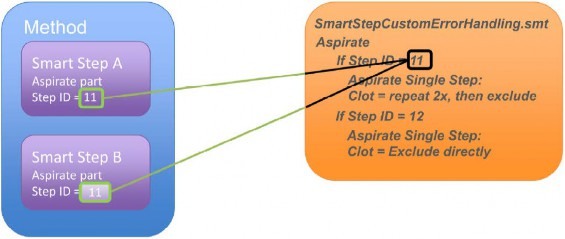

# Customized Error Handling

_For various error situations, a defined walk-away error handling which uses predefined default settings can be set. Smart Steps, Easy Steps and Single Steps offer this possibility._

_Three different levels of error handling are determined:_

_Fully manual:_

_This behavior is the standard error handling._

1. _An error dialog will be prompted._
2. _The user has to select or indicate a recovery action that will be executed._
3. _After doing so, the recovery action dialog has to be closed by the user._

_Semi-automated:_

1. _An error dialog will be prompted._
2. _The user has to select or indicate a recovery action that will be executed._
3. _The recovery action dialog will appear in a limited time. If the user does not specify an error recovery during the given timeframe, the dialog box closes automatically and will execute the default error handling._

_Fully automated (walk away):_

1. _No error dialog opens on the screen._
2. _The first defined recovery action will be executed immediately after an occurrence of an error._
3.  _If the first recovery action is unsuccessful, the second defined recovery action will be executed._

    _For every instrument-specific easy/single step of the method, an individual error recovery can be defined. The following configurations are possible:_

    * _Appearance of the error recovery dialogs (which buttons are available)_
    * _Default procedure_
    * _Which error is flagged in the trace file_
    *   _A timeout (the timeframe of the dialog when it will automatically close down) after which the default recovery action will be executed_

        _To Customize the Settings:_

        _Disable the “Use Default” and the “Timeout: Infinite” Checkboxes. Only then the other settings become editable. A br‌ief error description is given, followed by the available recovery options. Only one default procedure can be selected._
    *

        1.
           *   _Among the choices are:_

               \

               | Cancel  | Quits the current step and starts the user defined error handling if specified. If no user defined error handling is present, the method aborts. |
               | ------- | ------------------------------------------------------------------------------------------------------------------------------------------------ |
               | Abort   | Aborts the method                                                                                                                                |
               | Bottom  | Repeat the step at the bottom of the container                                                                                                   |
               | Exclude | Exclude all pipetting channels with this error and continue                                                                                      |
               | Repeat  | Repeat the command                                                                                                                               |
               | Air     | Aspirate air and continue                                                                                                                        |

               \

           * _Use the “Visible” Flag to add the appropriate button to the error recovery dialog box._
           * _The “Set error flag” will mark an erroneous container in the database._
           * _It is also possible to enable walk-away handling of errors (semi- and fully-automated mode):_
           * _Disable the “Timeout: Infinite” Checkbox. Enter a timeout into the input field. The run time error dialog then pops-up, waits for the specified timeout and closes to continue with the default error recovery chosen for this error. If the timeout is set to 0, no dialog will open: the selected error recovery will be executed automatically._
           * _If the user clicks on the error during the timeout, the walk-away will be stopped, and the user has to select a recovery and continue manually._
           *   _For a list of all errors and their recovery options, refer to the online-help and the error settings dialog._

               _Because of this, every instrument-specific Smart Step, Easy Step or Single Step has an \[Error Settings…] Button. Here is an example of the “1000μl Channel Aspirate” (Single Step):_

               * 
           * _Like all the other types of errors found in the list, “Liquid Level Error” is activated with the default settings._

        \

        _Error Settings:_

        \

        

        | 
The Column <em>Step</em> shows all the individual parts of a Smart Step (what is executed inside a Smart Step)

The Column <em>Step ID</em> allows the the programmer to select:

or to pass an ID for a customized behavior in case of an error.
 |
        | ------------------------------------------------------------------------------------------------------------------------------------------------------------------------------------------------------------------------------------------------------------------ |
        | 
 

<em>if an ‘Error handling by the user’ shall be used</em>
                                                                                                                                                                                        |

        * _2 - Abort Method_
        * _1 - Abort / Cancel Step_
        * _0 - Default error recovery_

        

        \

        

        _Use the Go To column to customize the error handling:_

        

        _To keep it simple for the programmer, the Go To leads towards the submethod library containing the customizeable error handling._

        _Select the part of the step where you want to customize the error handling, and click on the Go To Tab._

        _Clicking on Go To, a Submethod Library is opened. This Submethod Library is the interface for the programmer to define customized error handling in Smart Steps._

        _For every section of the Smart Step, a group with the equivalent single step is shown. Each of these groups has an ID (Code)._

        \

        

        _This Single Step can now be modified to control the behavior in case of an error, in the same way as on a directly programmed Single Step._

        \

        

        _Schematic Explanation_

        \

        | 
 
                                                                                                                         | The Error handling defined in this section will be executed |
        | ----------------------------------------------------------------------------------------------------------------------------------- | ----------------------------------------------------------- |
        | 

Smart Step A has Step ID 11 defined for an Aspirate Error
 | Same is true for Smart Step B with Step ID 12.              |
        | 
 

Of course, both Smart Steps could use the same error Step ID!
                                                     |                                                             |

        

        \

        _Import/Export behavior_

        _To make sure the SmartStepCustomErrorHandling Submethod is exported, the flag ‘Export original Hamilton files’ must be checked:_

        \

        

        _During import, check the flag ‘Import original Hamilton files’._

        \

        

        \

        

        _ATTENTION_

        _Please be aware that the imported Submethod Library will overwrite the existing one! If you have added customized code blocks in your existing library, please copy this code before importing and add it after the import._

        

        _-1: Abort/Cancel (jump to Error handling by the user)_

        _0: Default (use the default given in the acc. step)_

        _1-n: customized error handling code block_ (example here: 11)

        _Any other positive integer number refers to a group in the SmartStepCustomErr orHandling.smt_

        _-2: ABORT_

        \

        \

        _As seen, the Single Step in the Submethod Library acts as a ‘container’ for the error behavior. To customize it, just make the desired changes in the error handling of this step._

        

        

        

        _To do so, the following steps have to be performed:_

        \

        | Error settings |
        | -------------- |
        |                |
        | Go To          |

        * _In the Smart Step, click on_
        * _Activate the Customized error recovery radio button_
        * _In the line Aspirate, click on_
        *   _In the Submethod Library, double-click the Aspirate Step_

            

            \

            
        *   _In the Aspirate Step, click the_

            _Error Settings Tab_

            \

            

            _The Error Handling Panel opens:_
        * _Select the Clot Error line_
        * _In Timeout, switch to Custom (0)_
        * _Set the 1st recovery to Repeat_
        * _Set the 2nd recovery to Exclude_
        * _Define the Repetitions for the First Recovery_
        * _Close this dialog with OK_
        * _Close the Single Step with OK_

        |             |
        | ----------- |
        | 
 
 |
        |             |
        | 
 
 |
        | 
 
 |

        * _Keep the StepID in mind – this is the ‘link’ for the Smart Step_
        * _Close the Submethod Library_
        * _Insert the StepID in the Smart Step Aspirate Error definition_
        * _Confirm with OK, then close the Smart Step with Finish_

        

        

        _Adding more Error Blocks with unique Step IDs_

        _If additional error options are needed, simply copy a Customizable code group and change the_

        _stepID to a not yet used integer number._

        \

        

        \

        _If additional error options are needed, simply copy a Customizable code group and change the_

        _stepID to a not yet used integer number._

        \

        

        

        \

        1.  #### _‌Example 1: Error Settings with Easy/ Single Steps‌_

            \

            _This example shows how to configure an Easy Step Aspirate to repeat the aspiration in case of a clot error. If the second aspiration fails as well, the erroneous pipetting channel will be excluded._

            \

            

            \

            

            _As seen in the image above, the checkboxes “Use Default” and the “Timeout: Infinite” are not activated._

            _Subsequently, the first recoveries are activated. In this case, a REPEAT error is selected as the first error handling. It first tries one time to aspirate the sample probe. In case of a clot, the aspirated liquid is dispensed with half speed. Afterwards a second attempt at aspiration occurs. After a failed repeat attempts, this pipetting channel is excluded (second recovery = EXCLUDE)._

            _Based on this principle, the desired error handling can be set for every listed error._

            \

        2.  #### _‌Example 2: Error Handling by the User‌_

            \

            _If none of the pre-defined possibilities in the error setting matches the user’s needs, an individual error handling can be programmed through the step “Error Handling by the User”._

            \

            

            \

            _The steps to be observed are programmed in between “Begin Error Handling by the User” and “End Error Handling by the User”._

            _If any error occurs in such a step, the method proceeds to the steps between “Begin Error Handler” and “End Error Handler”. This is the user defined error handling._

            _As a result, every desired error handling can be programmed._

            \

            

            _NOTE_

            _The error settings of the specific error in the corresponding step have to be set to CANCEL to be able to use the “Error Handling by the User”._

            _To make use of the “Error Handling by the User”, the settings listed below must be considered. The example on the previous page shows a “1000μl Channel Aspirate” Step where the clot handling is controlled through the “Error Handling by the User”:_

            1. _Unmark the “Use default” Checkbox_
            2. _Unmark the “Infinite” Checkbox_
            3. _Set the \[Cancel] Radio Button_
