# Libraries

*   ### _Using Libraries‌_

    \

    _A library is a collection of standard functions which the programmer can choose from when writing methods in addition to the toolbox elements. The best-known functions are the mathematical functions. For these, VENUS Software provides a mathematical function library. There are several other libraries that can be found to be useful. If the library required hasn’t been installed yet, install it through "Tools  Hamilton Support Software..."._

    _To use library functions in a method, include the appropriate library. Follow these steps:_

    1. _Select "Method  Libraries..." in the Labware Editor to open the dialog seen below._
    2.  _To add a library, click the Browse Button \[...] at the center of the table highlighted below or click the \[Add Library...] Button._

        \

        

        \

    3. _In the file selection box, select the required library to be imported. Click \[OK]._
    4. _Repeat steps 2 through 4 to import all the libraries needed._
    5. _Click \[OK] to close the dialog. The selected library functions are available under their own group tab in the toolbox and can be used like standard commands._
    6.  _To remove libraries, select the libraries to be removed and click the \[Remove Library] Button._

        \

        

        _NOTE_

        _If a method uses at least on function of a library, the library cannot be removed._

        \

        _VENUS Software supports two kinds of libraries: HSL Libraries (.hsl) and Sub-method Libraries (.smt)._

        _A library function can also be self-written and can be used like any standard library through the following:_

        * _Graphical Method Editor (to create a Sub-method library)_
        * _HSL Method Editor (to create an HSL library)_
    7.  #### _‌Array Library‌_

        \

        \

        

        \

    8.  #### _‌Barcode Library‌_

        _Array Library is an old library. Its functions should not be used anymore. All array-related steps can be found in the General Steps. Arrays can be used directly in most steps._

        \

        _The HSLBarcodeReader library supports the Metrologic barcode scanner Orbit/MS7120 for read operations over the serial interface RS232._

        \

        | Command            | Icon                                                                      | Action Performed                                                                              |
        | ------------------ | ------------------------------------------------------------------------- | --------------------------------------------------------------------------------------------- |
        | Del Com Buffer     | 
 

 | Deletes the input buffer.                                                                     |
        | Read               | 
 

 | Gets read barcode from Metrologic barcode scanner Orbit/MS7120.                               |
        | Set Com Port       | 
 

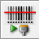
 | Sets the serial port on which the Metrologic barcode scanner Orbit/MS7120 is plugged.         |
        | Set Error Recovery | 
 

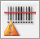
 | Sets a flag that indicates how to react on a reading error                                    |
        | Set Simulation     | 
 

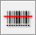
 | Defines whether the Metrologic barcode scanner shall be simulated instead of reading barcodes |
        | Set Timeout        | 
 

 | Sets the new timeout for all read operations of Metrologic barcode scanner Orbit/MS7120.      |
    9.  #### _‌Deck Visualization Library‌_

        \

        _The deck visualization library updates lists and views._

        \

        | Command               | Icon                                                                      | Action Performed                                             |
        | --------------------- | ------------------------------------------------------------------------- | ------------------------------------------------------------ |
        | Update Loaded Labware | 
 

 | Updates the list of loaded labware and updates the view.     |
        | Update Used Labware   | 
 

 | Updates the list of labware being used and updates the view. |
        | Update Used Positions | 
 

 | Updates the list of loaded labware and updates the view.     |

        \

    10. #### _‌Device Library‌_

        \

        _The device library offers a set of commands to collect labware and device details._

        \

        | Command                     | Icon                                                                                               | Action Performed                                                                                                                                                                                                                                                                  |
        | --------------------------- | -------------------------------------------------------------------------------------------------- | --------------------------------------------------------------------------------------------------------------------------------------------------------------------------------------------------------------------------------------------------------------------------------- |
        | DevAddContainerTo Rack      | 
 

 | Replaces a container on a rectangular pre-loaded rack.                                                                                                                                                                                                                            |
        | DevAddLabware               | 
 

 | Adds given labware to Deck Layout using deck coordinates.                                                                                                                                                                                                                         |
        | DevAddLabware ToTemplate    | 
 

 | Adds given labware to deck site on named template.                                                                                                                                                                                                                                |
        | DevAddPreloaded Labware     | 
 

 | Adds given labware including any preloaded labware to Deck Layout using deck coordinates.                                                                                                                                                                                         |
        | DevAddSequence              | 
 

 | Adds a sequence to the collection holding the editable sequences of the device.                                                                                                                                                                                                   |
        | DevAddSequence2             | 
 

 | Adds a sequence to the collection holding the editable sequences of the device.                                                                                                                                                                                                   |
        | DevCompute ContainerVolume  | 
 

 | Calculates the volume in ml for the container at the given position and the given internal height. The function does NOT support connected containers.                                                                                                                            |
        | DevCompute ContainerVolume2 | 
 

 | Calculates the volume in ml for the container at the given position and the given internal height. The function supports connected containers.                                                                                                                                    |
        | DevCopyReset Sequence       | 
 

 | 
Reloads a copy of the original deck sequence with the name sequenceName from the Deck Layout file into the sequence object sequenceObj. All indexes, limits and positions are re-initialized. The sequence must exist.

The original deck sequence remains unchanged.
 |

        | Command                      | Icon                                                                                               | Action Performed                                                                                                                                                                                                                                                                                                                         |
        | ---------------------------- | -------------------------------------------------------------------------------------------------- | ---------------------------------------------------------------------------------------------------------------------------------------------------------------------------------------------------------------------------------------------------------------------------------------------------------------------------------------- |
        | DevEditSequences             | 
 

 | 
Displays the “Edit Sequence” Dialog which shows the Deck Layout with all the sequence positions of the sequences set by the DevAddSequence() or the DevAddSequence2() functions.

The “Edit Sequence” Dialog allows it to enabled / disabled sequence positions on the Deck Layout in a graphical manner by using the mouse.
 |
        | DevEditSequences2            | 
 

 | 
Displays the “Edit Sequence” Dialog which shows the Deck Layout with all the sequence positions of the sequences set by the DevAddSequence() or the DevAddSequence2() functions.

The “Edit Sequence” Dialog allows it to enabled / disabled sequence positions on the Deck Layout in a graphical manner by using the mouse.
 |
        | DevGetBarcodeData            | 
 

 | 
Gets the barcode mask for the instance of labware at

a position.
                                                                                                                                                                                                                                                            |
        | DevGetBarcodeData2           | 
 

 | Gets the barcode masks for the instances of labware at positions.                                                                                                                                                                                                                                                                        |
        | DevGetBarcodeData3           | 
 

 | Gets the barcode masks for the instances of labware at positions.                                                                                                                                                                                                                                                                        |
        | DevGetCfgValueWith Key       | 
 

 | Returns the configuration value for the instrument mapped to a given key (integer, float, or string).                                                                                                                                                                                                                                    |
        | DevGetDeckLayoutFile Name    | 
 

 | Returns the absolute Deck Layout file name (string; may be empty for a device without Deck Layout).                                                                                                                                                                                                                                      |
        | DevGetInstrument Name        | 
 

 | Returns the property value for a property key of a labware.                                                                                                                                                                                                                                                                              |
        | DevGetLabwareData            | 
 

 | Obtains the position of the given labware item from the Deck Layout using deck coordinates.                                                                                                                                                                                                                                              |
        | DevGetLabware Position       | 
 

 | Obtains the position of the given labware item from the Deck Layout using deck coordinates.                                                                                                                                                                                                                                              |
        | DevGetLabware Positionex     | 
 

 | Obtains the position of the given labware item from the Deck Layout using deck coordinates.                                                                                                                                                                                                                                              |
        | DevGetLabware Positionex2    | 
 

 | Obtains the position information of the given labware item from the Deck Layout using deck coordinates.                                                                                                                                                                                                                                  |
        | DevGetPosition LabwareNameAt | 
 

 | Retrieves the template site with associated labware name or labware name with associated position name at a given index, retrieved during a previous call to the function Get Positions Labware Names.                                                                                                                                   |
        | DevGetPosition LabwareNames  | 
 

 | Retrieves template sites with associated labware names or labware names with associated position names of all positions on the given labware which are referenced by the specified sequence.                                                                                                                                             |

        | Command                                 | Icon                                                                                               | Action Performed                                                                                                                                                 |
        | --------------------------------------- | -------------------------------------------------------------------------------------------------- | ---------------------------------------------------------------------------------------------------------------------------------------------------------------- |
        | DevGetReleaseVersion                    | 
 

 | 
Returns the release version for the instrument,

e.g. 3.0.0.630 (string).
                                                                            |
        | DevGetSequence                          | 
 

 | Gets a copy of the deck sequence with the name sequenceName.                                                                                                     |
        | DevGetSequenceRef                       | 
 

 | Gets a reference to the deck sequence with the name seqId.                                                                                                       |
        | DevGetTemplate LabwareNameAt            | 
 

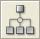
 | Returns the labware name with associated template name at a given index.                                                                                         |
        | DevGetTemplateLabware Names             | 
 

 | Queries labware names with associated template name.                                                                                                             |
        | DevIsValidLabwareFor CurrentDeck-Layout | 
 

 | Checks whether the given labware is valid for the current Deck Layout.                                                                                           |
        | DevPause                                | 
 

 | Suspends the program execution at the current position.                                                                                                          |
        | DevRemoveLabware                        | 
 

 | Removes given labware from the deck.                                                                                                                             |
        | DevRemoveLabware FromTemplate           | 
 

 | Removes given labware from named template.                                                                                                                       |
        | DevRemoveSequences                      | 
 

 | Removes all sequences from the collection holding the editable sequences of the device.                                                                          |
        | DevResetSequence                        | 
 

 | Reloads the original deck sequence with the name seqId from the Deck Layout file, all indexes, limits and positions are re-initialized. The sequence must exist. |
        | DevSetBarcodeData                       | 
 

 | 
Sets the barcode mask for the instance of labware at

a position.
                                                                                    |
        | DevSetBarcodeData2                      | 
 

 | Sets the barcode masks for the instances of labware at positions.                                                                                                |
        | DevSetBarcodeData3                      | 
 

 | Sets the barcode masks for the instances of labware at positions.                                                                                                |
    11. #### _‌Error Library‌_

        \

        _The error library contains functions to display and manage errors._

        \

        | Command           | Icon                                                                                                  | Action Performed                                                                                                                                                                                                      |
        | ----------------- | ----------------------------------------------------------------------------------------------------- | --------------------------------------------------------------------------------------------------------------------------------------------------------------------------------------------------------------------- |
        | ErrClear          | 
 

 | Clears all property settings of the err object.                                                                                                                                                                       |
        | ErrCode           | 
 

 | Extracts a numeric value that specifies the code of a phoenix error.                                                                                                                                                  |
        | ErrDisplay Error  | 
 

 | Displays an error in a message box.                                                                                                                                                                                   |
        | ErrGetDataAt      | 
 

 | Returns the element at the specified index from the data stored in the error object. If the index is 0, the function returns the size of the data stored in the error object.                                         |
        | ErrGetDescription | 
 

 | Returns a descriptive string associated with an error.                                                                                                                                                                |
        | ErrGetId          | 
 

 | Returns a numeric value that specifies an error.                                                                                                                                                                      |
        | ErrMajor          | 
 

 | 
Extracts a numeric value that specifies the major ID of

a phoenix error.
                                                                                                                                 |
        | ErrMinor          | 
 

 | 
Extracts a numeric value that specifies the minor ID of

a phoenix error.
                                                                                                                                 |
        | ErrRaise          | 
 

 | Generates a run-time error. The error will be traced automatically.                                                                                                                                                   |
        | ErrRaiseLast      | 
 

 | Re-generates the current run-time error.                                                                                                                                                                              |
        | ErrSetDataAt      | 
 

 | Sets the element in the data stored in the error object at the specified index (size of data not allowed to grow if 0 < index). If the index is 0, the function sets the size of the data stored in the error object. |
        | ErrSetDescription | 
 

 | Sets a descriptive string associated with an error.                                                                                                                                                                   |
        | ErrSetId          | 
 

 | Sets a numeric value that specifies an error.                                                                                                                                                                         |
    12. #### _‌File Library‌_

        \

        _The file library contains all commands necessary for a method to handle files._

        \

        | Command              | Icon                                                                                                  | Action Performed                                                                                                                                                                                                                                               |
        | -------------------- | ----------------------------------------------------------------------------------------------------- | -------------------------------------------------------------------------------------------------------------------------------------------------------------------------------------------------------------------------------------------------------------- |
        | FilEof               | 
 

 | Indicates that the end of file (Eof) is reached.                                                                                                                                                                                                               |
        | FilFindFile          | 
 

 | Starts a file search.                                                                                                                                                                                                                                          |
        | FilFindNextFile      | 
 

 | Continues a file search from a previous call to FilFindFile.                                                                                                                                                                                                   |
        | FilFormatBarcodeFile | 
 

 | Converts the weakly formatted barcode file, written as ASCII text file during the LoadCarrier operation, into a strongly formatted barcode file. The strongly formatted barcode file may be an ASCII text file, a Microsoft Excel, or a Microsoft Access file. |
        | FilGetBinPath        | 
 

 | Retrieves the path to the Hamilton\Bin folder.                                                                                                                                                                                                                 |
        | FilGetCommState      | 
 

 | Retrieves the configuration information for a specified communication resource. The entries of the structure that retrieves the configuration information must be accessible in the global scope.                                                              |
        | FilGetCommTimeouts   | 
 

 | 
Retrieves the time-out parameters for all read and write operations for a specified communication resource.

The entries of the structure that retrieve the configuration information must be accessible in the global scope.
                      |
        | FilGetConfigPath     | 
 

 | Retrieves the path to the Hamilton\Config folder.                                                                                                                                                                                                              |
        | FilGetLibraryPath    | 
 

 | Retrieves the path to the Hamilton\Library folder.                                                                                                                                                                                                             |
        | FilGetLogFilePath    | 
 

 | Retrieves the path to the Hamilton\Logfiles folder where runtime generated log files are stored.                                                                                                                                                               |
        | FilGetMethodsPath    | 
 

 | Retrieves the path to the Hamilton\Methods folder where all the methods are stored.                                                                                                                                                                            |
        | FilGetSystemPath     | 
 

 | Retrieves the path to the Hamilton\System folder.                                                                                                                                                                                                              |
        | FilIsNull            | 
 

 | Returns non-zero if the variable is a null value (SQL style Null).                                                                                                                                                                                             |

        | Command            | Icon                                                                                                  | Action Performed                                                                                                                                                                                                                                                                    |
        | ------------------ | ----------------------------------------------------------------------------------------------------- | ----------------------------------------------------------------------------------------------------------------------------------------------------------------------------------------------------------------------------------------------------------------------------------- |
        | FilReadString      | 
 

 | Reads the next record from the file data source as string-valued data. Row data, but no schema data, is saved to the string. After calling FilReadString, the next unread record becomes the current record, or the Eof property is set to hslTrue if there are no more records.    |
        | FilRemoveFields    | 
 

 | Removes all fields from a record definition.                                                                                                                                                                                                                                        |
        | FilSearchPath      | 
 

 | Searches for the specified file.                                                                                                                                                                                                                                                    |
        | FilSetCommState    | 
 

 | Configures a communication resource according to the specifications in a structure that contains the configuration information. Each entry in the structure is optional and overwrites the default value in parentheses.                                                            |
        | FilSetCommTimeouts | 
 

 | 
Sets the time-out parameters for all read and write operations on a specified communication resource.

The structure that contains the time-out information is as shown below. Each entry in the structure is optional and overwrites the default value in parentheses.
 |
        | FilUpdateRecord    | 
 

 | Updates the current record of the file object with the values of the variable objects specified in the record definition. The current record remains current after calling the FilUpdateRecord function. The provider must support UPDATE.                                          |
        | FilWriteString     | 
 

                        | Writes a string to the end of the file data source. After calling the FilWriteString function, the new record becomes the current record.                                                                                                                                           |

        \

    13. #### _‌ML STAR DC Wash Station Library‌_

        \

        _The “HSLDcWasher” Prefix has been removed for a better overview._

        \

        | Command              | Icon                                                                                                                            | Action Performed                                                                                                                                                                                        |
        | -------------------- | ------------------------------------------------------------------------------------------------------------------------------- | ------------------------------------------------------------------------------------------------------------------------------------------------------------------------------------------------------- |
        | WashSettings         | 
 

         | Sets independent wash parameters for each DC wash station needle sequence.                                                                                                                              |
        | NeedleWash           | 
 

           | Washes the already picked up needles in the DC wash station.                                                                                                                                            |
        | NeedleWash2          | 
 

          | 
Washes the already picked up needles in the

DC wash station. Other than the NeedleWash step the NeedelWash2 step allows to specify further parameters used for dispensing the rest volume.
 |
        | EmptyFillWashChamber | 
 

 | Either refills or to drains the wash chamber after last wash cycle.                                                                                                                                     |
    14. #### _‌Kit Lot Library‌_

        \

        _The "HSLKitLotLib.hsl" Library provides remarkable functions that handles barcodes of kit lots for the ML STAR._

        _The “HSLKitLot” Prefix has been removed for a better overview._

        \

        | Command               | Icon                                                                      | Action Performed                                                                               |
        | --------------------- | ------------------------------------------------------------------------- | ---------------------------------------------------------------------------------------------- |
        | Check Barcode         | 
 

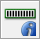
 | Check if a barcode fits a particular mask.                                                     |
        | Check Kit Lot         | 
 

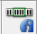
 | Check if kit lot contained in a barcode is valid.                                              |
        | Get Kit Lot Value     | 
 

 | Get an arbitrary value from kit lot.                                                           |
        | Set Access Repetition | 
 

 | Set the number of denied access attempts for a kit lot file.                                   |
        | SetDateColName        | 
 

 | Define the name of the column in the kit lot file which contains the kit lot expiry date.      |
        | SetIdColName          | 
 

 | Define the name of the column in the kit lot file which contains the kit lot identifier.       |
        | SetKitlotFile         | 
 

 | Define the name of the kit lot file.                                                           |
        | SetKitlotPath         | 
 

 | Define the location of the kit lot file.                                                       |
        | SetTableName          | 
 

 | Define the name of the Excel sheet in the kit lot file which contains the kit lot information. |
        | SetTimeColName        | 
 

 | Define the name of the column in the kit lot file which contains the kit lot expiry time.      |
        | SplitBarcode          | 
 

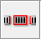
 | Extract a substring of a barcode.                                                              |
    15. #### _‌Labware State Library‌_

        \

        _The HSL Labware State Library provides labware state management and labware controlling functions._

        _The “HSLLabwState” Prefix has been removed for a better overview._

        \

        | Command                      | Icon                                                                                                        | Action Performed                                                                                                                                                                                                   |
        | ---------------------------- | ----------------------------------------------------------------------------------------------------------- | ------------------------------------------------------------------------------------------------------------------------------------------------------------------------------------------------------------------ |
        | AddLabware SourceBarcode     | 
 

 | Adds an additional barcode as source barcode of the labware at the current position of the given sequence.                                                                                                         |
        | GetLabwareBarcode            | 
 

 | Returns the barcode of the labware at the current position of the given sequence.                                                                                                                                  |
        | GetLabwareBarcode Mask       | 
 

 | Returns the barcode mask of the labware at the current position of the given sequence.                                                                                                                             |
        | GetLabwareExpNumOf ProcSteps | 
 

 | Retrieves the expected number of processed steps for the labware at the current position of the given sequence.                                                                                                    |
        | GetLabwareId                 | 
 

 | Returns the labware id for the current position of the given sequence.                                                                                                                                             |
        | GetLabwareLastAction State   | 
 

 | Retrieves the action state of the last performed action for the labware at the current position of the given sequence.                                                                                             |
        | GetLabwareLast SourceBarcode | 
 

 | 
Returns the last known source barcode of the labware

at the current position of the given sequence.
                                                                                                   |
        | GetLabwareNumOf ProcSteps    | 
 

 | Retrieves the number of processed steps of the labware at the current position of the given sequence.                                                                                                              |
        | GetLabwareRelation           | 
 

 | Returns the labware id of the chosen parent of the labware at the current position of the given sequence.                                                                                                          |
        | GetLabwareSource Barcodes    | 
 

 | 
Returns an array with all source barcodes of the labware at the current position of the given sequence.

This function uses the sample tracker. It will cause an error if sample tracking is disabled.
 |
        | GetLabwareSummary State      | 
 

 | Retrieves the current summary state of the labware at the current position of the given sequence.                                                                                                                  |
        | GetLabwareVisibility         | 
 

 | Returns the visibility of the labware at the current position of the given sequence.                                                                                                                               |
        | GetLabwareVolume             | 
 

 | Retrieves the volume of the labware at the current position of the given sequence.                                                                                                                                 |
        | Is Labware Connected         | 
 

 | 
Returns hslTrue, if the labware at the current position

of the given sequence is part of a connected container definition, else hslFalse.
                                                             |

        | Command                           | Icon                                                                                                        | Action Performed                                                                                                |
        | --------------------------------- | ----------------------------------------------------------------------------------------------------------- | --------------------------------------------------------------------------------------------------------------- |
        | Set Labware Barcode               | 
 

 | Sets a new barcode for the labware at the current position of the given sequence.                               |
        | Set Labware Barcode Mask          | 
 

 | Sets a new barcode mask for the labware at the current position of the given sequence.                          |
        | Set Labware Exp Num Of Proc Steps | 
 

 | Sets the expected number of processed steps for the labware at the current position of the given sequence.      |
        | Set Labware Summary State         | 
 

 | 
Overwrites the current summary state of the labware

at the current position of the given sequence.
 |
        | Set Labware Visibility            | 
 

 | 
Sets the visibility of the labware at the current position

of the given sequence.
                  |
        | Set Labware Volume                | 
 

 | 
Sets the volume of the labware at the current position

of the given sequence.
                      |

        \

    16. #### _‌ML STAR Library‌_

        \

        _The “HSLML\_STAR” Prefix has been removed for a better overview_

        \

        | Command                                  | Icon                                                                          | Action Performed                                                                                        |
        | ---------------------------------------- | ----------------------------------------------------------------------------- | ------------------------------------------------------------------------------------------------------- |
        | AntiDropletControl\_1000ulChannel\_On    | 
 

 | Activates the Anti-Droplet Control (ADC) on the 1000μl-pipetting channels.                              |
        | AntiDropletControl\_1000ulChannel\_Off   | 
 

 | Deactivates the Anti-Droplet Control (ADC) on the 1000μl-pipetting channels.                            |
        | AntiDropletControl\_5mlChannel\_On       | 
 

 | Activates the Anti-Droplet Control (ADC) on the 5ml-pipetting channels.                                 |
        | AntiDropletControl\_5mlChannel\_Off      | 
 

 | Deactivates the Anti-Droplet Control (ADC) on the 5ml-pipetting channels.                               |
        | AspirationMonitoring\_1000ulChannel\_Off | 
 

 | Disables the aspiration and clot detection monitoring with the ‘pLLD’ on the 1000μl-pipetting channels. |
        | AspirationMonitoring\_1000ulChannel\_On  | 
 

 | Enables the aspiration and clot detection monitoring with the ‘pLLD’ on the 1000μl-pipetting channels.  |
        | AspirationMonitoring\_5mlChannel\_Off    | 
 

 | Disables the aspiration and clot detection monitoring with the ‘pLLD’ on the 5ml-pipetting channels.    |
        | AspirationMonitoring\_5mlChannel\_On     | 
 

 | Enables the aspiration and clot detection monitoring with the ‘pLLD’ on the 5ml-pipetting channels.     |

        | Command                                     | Icon                                                                                                                           | Action Performed                                                                                                                                                                                                                      |
        | ------------------------------------------- | ------------------------------------------------------------------------------------------------------------------------------ | ------------------------------------------------------------------------------------------------------------------------------------------------------------------------------------------------------------------------------------- |
        | ClotDetectionMonitoring\_1000µlChannel\_Off | 
 

                                                  | Disables the clot detection monitoring with the ‘cLLD’ on the 1000μl-pipetting channels.                                                                                                                                              |
        | ClotDetectionMonitoring\_1000µlChannel\_On  | 
 

                                                  | Enables the clot detection monitoring with the ‘cLLD’ on the 1000μl-pipetting channels.                                                                                                                                               |
        | ClotDetectionMonitoring\_5mlChannel\_Off    | 
 

                                                  | Disables the clot detection monitoring with the ‘cLLD’ on the 5ml-pipetting channels.                                                                                                                                                 |
        | ClotDetectionMonitoring\_5mlChannel\_On     | 
 

                                                  | Enables the clot detection monitoring with the ‘cLLD’ on the 5ml-pipetting channels.                                                                                                                                                  |
        | CreateATBarcodefile                         | 
 

           | Creates an AT Barcode file for a MTP with the AT Barcode filter program.                                                                                                                                                              |
        | DeleteBarcodeFile                           | 
 

             | Deletes an existing barcode file.                                                                                                                                                                                                     |
        | ExecuteWorklist                             | 
 

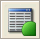
               | Executes a worklist written in the Gemini worklist file format (Gemini Worklist File Schema Information).                                                                                                                             |
        | FormatBarcodeFile                           | 
 

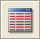
             | Converts the mixed formatted barcode file 'barcodeFileName', written as ASCII text file by the LoadCarrier step, into a single formatted barcode file 'formattedBarcodeFileName' using the Formatted Barcode File Schema Information. |
        | GetContainerVolume                          | 
 

            | Retrieves the volume \[ml] of the container measured by the n-th channel during the previous MeasureContainerVolume operation.                                                                                                        |
        | GetInstrumentType                           | 
 

             | 
Gets the type of the connected instrument of type ML-STAR.

Use this function only when no global device is defined.
                                                                                                      |
        | GetInstrumentType\_GlobalDevice             | 
 

 | Gets the type of the passed instrument.                                                                                                                                                                                               |
        | IsSimulatorMode                             | 
 

               | Probes whether the past instrument is in simulator mode or whether it is connected to a real instrument.                                                                                                                              |
        | MeasureContainerVolume2                     | 
 

       | The MeasureContainerVolume function measures the volume \[ml] of the container(s) beginning at the current position of a given sequence and using the given pipetting channel pattern.                                                |
        | SetBarcodeTypes                             | 
 

               | Sets the barcode types.                                                                                                                                                                                                               |

        | Command                             | Icon                                                                          | Action Performed                                                                                                               |
        | ----------------------------------- | ----------------------------------------------------------------------------- | ------------------------------------------------------------------------------------------------------------------------------ |
        | SetPressureThreshold\_1000ulChannel | 
 

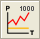
 | Sets the pressure threshold for the aspiration and clot detection monitoring with the ‘pLLD’ on the 1000μl-pipetting channels. |
        | SetPressureThreshold\_5mlChannel    | 
 

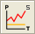
 | Sets the pressure threshold for the aspiration and clot detection monitoring with the ‘pLLD’ on the 5ml-pipetting channels.    |

        \

    17. #### _‌Mapping Report Library‌_

        \

        _The HSL mapping report library provides functions to create mapped report files for the labware out of the sample tracking database within a method run._

        _The “HSLMAPREPORT” Prefix has been removed for a better overview._

        \

        | Command                  | Icon                                                                                                                         | Action Performed                                                                                                                                                                                                                                                           |
        | ------------------------ | ---------------------------------------------------------------------------------------------------------------------------- | -------------------------------------------------------------------------------------------------------------------------------------------------------------------------------------------------------------------------------------------------------------------------- |
        | AddFilterSequence        | 
 

        | Adds the specified filter sequence to the list of filters influencing the report file formatter. Once one or more filter sequences are set, only information about positions that match with a position in one of the filter sequences appears in the mapping report file. |
        | RemoveAllFilterSequences | 
 

 | Removes all filter sequences from the list of filters influencing the report file formatter.                                                                                                                                                                               |
        | GenerateMappingFile      | 
 

      | Creates the report-mapping files.                                                                                                                                                                                                                                          |
        | GetListSeparator         | 
 

         | Returns the list-separator, used as column- delimiter within the character separated value (.csv) report-mapping file.                                                                                                                                                     |
        | DeleteFile               | 
 

               | Deletes the specified file.                                                                                                                                                                                                                                                |
        | SetElementBarcode        | 
 

        | Sets the barcode to the associated labware within the sample tracking database.                                                                                                                                                                                            |
        | RemoveElement            | 
 

            | Removes the given labware from the access of sample tracking.                                                                                                                                                                                                              |
    18. #### _‌ML STAR Step Return Library‌_

        \

        _The step return library establishes functions to parse the result of the most frequently used ML STAR step return values._

        _The “StepReturn” Prefix has been removed on each command for a better overview._

        \

        | Command               | Icon                                                                                                               | Action Performed                                                                                                                                                                             |
        | --------------------- | ------------------------------------------------------------------------------------------------------------------ | -------------------------------------------------------------------------------------------------------------------------------------------------------------------------------------------- |
        | GetErrorCode          | 
 

 | Returns the error contained in the step return value (integer).                                                                                                                              |
        | GetNumberOfPositions  | 
 

 | Retrieves the number of positions (number of block delimiters) in the given step return value (integer).                                                                                     |
        | GetPosition           | 
 

 | Retrieves the num value for a specified position (block delimiter number) (integer).                                                                                                         |
        | GetMainError          | 
 

 | Retrieves the main error for a specified position (integer).                                                                                                                                 |
        | GetSlaveError         | 
 

 | Retrieves the slave error for a specified position (integer).                                                                                                                                |
        | GetRecoveryButton     | 
 

 | Retrieves the ID of the recovery button for a specified position (integer).                                                                                                                  |
        | GetBarcode            | 
 

 | Retrieves the barcode for a specified position (string).                                                                                                                                     |
        | GetBarcodeMask        | 
 

 | Retrieves the barcode mask for a specified position (string).                                                                                                                                |
        | GetBarcodePosition    | 
 

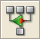
 | Retrieves the barcode position for a specified position (string).                                                                                                                            |
        | GetLastLiquidLevel    | 
 

 | Retrieves the last liquid level for a specified position (float).                                                                                                                            |
        | GetLabwareId          | 
 

 | Retrieves the labware identifier for a specified position (string).                                                                                                                          |
        | GetPositionId         | 
 

 | Retrieves the position identifier for a specified position (string).                                                                                                                         |
        | GetLabwarePositionIds | 
 

 | Retrieves the labware identifiers with associated position identifiers for a specified position (array of variables).                                                                        |
        | GetPositionFromNum    | 
 

 | Searches a step return value for the first match of a specified num value (integer). Returns the one- based position (block delimiter number) of the first match of the specified num value. |
        | GetStepData           | 
 

 | Generic function to retrieve the step data for a specified position (string).                                                                                                                |
        | SetFieldDelimiter     | 
 

 | Sets a new field delimiter for the step return (initial value is ",").                                                                                                                       |

        | Command             | Icon                                                                                                               | Action Performed                                                                                                        |
        | ------------------- | ------------------------------------------------------------------------------------------------------------------ | ----------------------------------------------------------------------------------------------------------------------- |
        | SetBlockDelimiter   | 
 

 | Sets a new block delimiter for the step return (initial value is "\[").                                                 |
        | SetFieldDelimiterEx | 
 

 | Sets the field delimiter for the step return as specified in the instrument configuration file (initial value is ",").  |
        | SetBlockDelimiterEx | 
 

                                 | Sets the block delimiter for the step return as specified in the instrument configuration file (initial value is "\["). |

        \

    19. #### _‌Math Library‌_

        \

        _The math library establishes functions for basic and advanced mathematical operations._

        \

        | Command       | Icon                                                                                                     | Action Performed                                                                                    |
        | ------------- | -------------------------------------------------------------------------------------------------------- | --------------------------------------------------------------------------------------------------- |
        | MthACos       | 
 

 | Returns the arccosine of a number.                                                                  |
        | MthASin       | 
 

 | Returns the arcsine of a number.                                                                    |
        | MthATan       | 
 

 | Returns the arctangent of a number.                                                                 |
        | MthBitwiseAND | 
 

 | Performs a bitwise conjunction on two expressions.                                                  |
        | MthBitwiseNOT | 
 

 | Performs a bitwise NOT (negation) on an expression.                                                 |
        | MthBitwiseOR  | 
 

 | Performs a bitwise disjunction on two expressions.                                                  |
        | MthBitwiseXOR | 
 

 | Performs a bitwise exclusive OR on two expressions.                                                 |
        | MthCeiling    | 
 

 | Returns the next highest integer that is greater than or equal to the specified numeric expression. |
        | MthCos        | 
 

 | Returns the cosine of an angle.                                                                     |
        | MthDec        | 
 

 | Decrements the value of a number by one.                                                            |
        | MthEqual      | 
 

 | Returns a Boolean value indicating the result of the comparison.                                    |
        | MthERandDraw  | 
 

 | Draws a new random number from the exponential distribution.                                        |
        | MthERandInit  | 
 

 | Initializes the exponential distribution                                                            |

        | Command               | Icon                                                                                                     | Action Performed                                                                                                               |
        | --------------------- | -------------------------------------------------------------------------------------------------------- | ------------------------------------------------------------------------------------------------------------------------------ |
        | MthExp                | 
 

 | Returns e (the base of natural logarithms) raised to a power.                                                                  |
        | MthFCeiling           | 
 

 | Returns a float value representing the next highest integer that is greater than or equal to the specified numeric expression. |
        | MthFloor              | 
 

 | Returns the nearest integer that is less than or equal to the specified numeric expression.                                    |
        | MthFFloor             | 
 

 | Returns a float value representing the nearest integer that is less than or equal to the specified numeric expression.         |
        | MthGreaterThan        | 
 

 | Returns a Boolean value indicating the result of the comparison.                                                               |
        | MthGreaterThanOrEqual | 
 

 | Returns a Boolean value indicating the result of the comparison.                                                               |
        | MthInc                | 
 

 | Increments the value of a number by one.                                                                                       |
        | MthLessThan           | 
 

 | Returns a Boolean value indicating the result of the comparison.                                                               |
        | MthLessThanOrEqual    | 
 

 | Returns a Boolean value indicating the result of the comparison.                                                               |
        | MthLog10              | 
 

 | Returns the base 10 logarithm of a number.                                                                                     |
        | MthLogicalAND         | 
 

 | Performs a logical conjunction on two expressions.                                                                             |
        | MthLogicalNOT         | 
 

 | Performs a logical negation on an expression.                                                                                  |
        | MthLogicalOR          | 
 

 | Performs a logical disjunction on two expressions.                                                                             |
        | MthLog                | 
 

 | Returns the natural logarithm of a number.                                                                                     |
        | MthMax                | 
 

 | Returns the greater of two supplied numeric (or string) expressions.                                                           |
        | MthMin                | 
 

 | Returns the lesser of two supplied numeric (or string) expressions.                                                            |
        | MthNotEqual           | 
 

 | Returns a Boolean value indicating the result of the comparison.                                                               |
        | MthNRandDraw          | 
 

 | Draws a new random number from the normal distribution.                                                                        |
        | MthNRandInit          | 
 

 | Initializes the normal distribution.                                                                                           |

        | Command       | Icon                                                                                                     | Action Performed                                                                                                                        |
        | ------------- | -------------------------------------------------------------------------------------------------------- | --------------------------------------------------------------------------------------------------------------------------------------- |
        | MthPow        | 
 

 | Returns the value of a base expression taken to a specified power.                                                                      |
        | MthURandInit  | 
 

 | Initializes the uniform distribution.                                                                                                   |
        | MthURandDraw  | 
 

 | Draws a new random number from the uniform distribution.                                                                                |
        | MthTan        | 
 

 | Returns the tangent of an angle.                                                                                                        |
        | MthSin        | 
 

 | Returns the sine of an angle.                                                                                                           |
        | MthShiftRight | 
 

 | The bitwise shift-right operator shifts its first operand to the right (>>) by the number of positions specified by the second operand. |
        | MthShiftLeft  | 
 

 | The bitwise shift-left operator shifts its first operand to the right (<<) by the number of positions specified by the second operand.  |
        | MthRound      | 
 

 | Returns a number rounded to a specified number of decimal places.                                                                       |
        | MthR01Init    | 
 

 | Initializes the random number generator.                                                                                                |
        | MthR01Draw    | 
 

 | Draws a new random number.                                                                                                              |
    20. #### _‌Object Library‌_

        \

        _The object library provides functions for handling automation objects. The “Object” Prefix has been removed for a better overview_

        | Command               | Icon                                                                                                      | Action Performed                                                                                                                                                                                                    |
        | --------------------- | --------------------------------------------------------------------------------------------------------- | ------------------------------------------------------------------------------------------------------------------------------------------------------------------------------------------------------------------- |
        | CreateObject          | 
 

        | Creates a reference to an automation object.                                                                                                                                                                        |
        | ReleaseObject         | 
 

 | Releases the reference to an automation object.                                                                                                                                                                     |
        | IsNull                | 
 

        | Returns true if the object is null (i.e. the object is not bound to an automation object), otherwise false.                                                                                                         |
        | PropertyGet           | 
 

        | Obtains the value of the specified property of an automation object.                                                                                                                                                |
        | PropertySet           | 
 

        | Sets the value of the specified property of an automation object.                                                                                                                                                   |
        | Invoke0               | 
 

        | 
Provides access to those functions exposed

by an automation object that take no arguments.
                                                                                                             |
        | Invoke1               | 
 

        | 
Provides access to those functions exposed

by an automation object that take one argument.
                                                                                                             |
        | Invoke2               | 
 

        | 
Provides access to those functions exposed

by an automation object that take two arguments.
                                                                                                            |
        | Invoke3               | 
 

        | Provides access to those functions exposed by an automation object that take three arguments.                                                                                                                       |
        | Invoke4               | 
 

        | 
Provides access to those functions exposed

by an automation object that take four arguments.
                                                                                                           |
        | Invoke5               | 
 

        | 
Provides access to those functions exposed

by an automation object that take five arguments.
                                                                                                           |
        | SetResultObject       | 
 

        | Specifies an object to be used to store the result of the next call to one of the invoke functions.                                                                                                                 |
        | ResetResultObject     | 
 

        | Resets the result object previously set by a call to the SetResultObject.                                                                                                                                           |
        | SetNumberOfParameters | 
 

        | Sets the number of parameters of the collection holding the parameters to be passed in the next call to the Invoke function to a function exposed by an automation object. A maximum of 20 parameters is supported. |
        | GetNumberOfParameters | 
 

        | Gets the number of parameters of the collection holding the parameters to be passed in the next call to the Invoke function to a function exposed by an automation object.                                          |

        | Command             | Icon                                                                                               | Action Performed                                                                                                                                                                                           |
        | ------------------- | -------------------------------------------------------------------------------------------------- | ---------------------------------------------------------------------------------------------------------------------------------------------------------------------------------------------------------- |
        | AddParameter        | 
 

 | Adds a new parameter to the collection holding the parameters to be passed in the next call to the Invoke function to a function exposed by an automation object. A maximum of 20 parameters is supported. |
        | SetParameterAt      | 
 

 | Sets the value of a parameter for a given index; number of parameters not allowed to grow.                                                                                                                 |
        | GetParameterAt      | 
 

 | Gets the value of a parameter for a given index.                                                                                                                                                           |
        | RemoveAllParameters | 
 

 | Removes all parameters from the collection holding the parameters to be passed in the next call to the Invoke function to a function exposed by an automation object.                                      |
        | Invoke              | 
 

 | Access to the functions exposed by an automation object.                                                                                                                                                   |
        | EnumNext            | 
 

 | Retrieves the next item in the enumeration sequence.                                                                                                                                                       |
        | EnumReset           | 
 

 | Resets the enumeration sequence to the beginning.                                                                                                                                                          |
    21. #### _‌Report Library‌_

        \

        _The HSL report library provides functions to create report files for labware out of the sample tracking database within a method run (e.g.: a comma separated value result file (.csv) or an AT barcode file)._

        _The “HSLReport” Prefix has been removed for a better overview._

        \

        | Command                    | Icon                                                                                                                     | Action Performed                                                                                      |
        | -------------------------- | ------------------------------------------------------------------------------------------------------------------------ | ----------------------------------------------------------------------------------------------------- |
        | AddToReportList            | 
 

            | Adds labware within the given sequence to an internal report list.                                    |
        | AddToReportListFromLabware | 
 

 | Adds labware within the given sequence to an internal report list.                                    |
        | Create ATBarcode File      | 
 

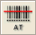
        | Executes the Hamilton AT-file filter program HxATFilter in quiet mode, to create the AT barcode file. |

        \

        

        _NOTE_

        _In creating an AT-Barcode file for vials containing more than one barcode (for example sample + reagent were dispensed into this well, both came from containers with a barcode), the last barcode in the pipetting order will be written into the AT-Barcode file._

        _To prevent overwriting, a sample barcode of a reagent barcode (reagent dispensed after the sample) has to be deleted. To do this, set an empty string as a barcode for the container using the SetLabwareBarcode command from the HSLLabwareState library between loading and pipetting._

        \

    22. #### _‌Sequence Library‌_

        \

        _The sequence library is very helpful for advanced sequence creation and handling._

        \

        | Command           | Icon                                                                                                          | Action Performed                                                                                                                                                             |
        | ----------------- | ------------------------------------------------------------------------------------------------------------- | ---------------------------------------------------------------------------------------------------------------------------------------------------------------------------- |
        | SeqAdd            | 
 

 | Adds the labware item with the name labwareId and the positionId at the end of the sequence.                                                                                 |
        | SeqAddEx          | 
 

 | Adds the labware item with the name labwareId and the positionId at the end of the sequence. For multi Deck Layouts. There is an additional parameter called device context. |
        | SeqCopySequence   | 
 

 | Overwrites the state of the target sequence object with the state of another sequence.                                                                                       |
        | SeqEdit           | 
 

 | Provides a way to edit a sequence graphically.                                                                                                                               |
        | SeqEdit2          | 
 

 | Provides a way to edit a sequence graphically.                                                                                                                               |
        | SeqEqualSequences | 
 

 | Determines whether the specified sequences are equal.                                                                                                                        |

        | Command                            | Icon                                                                                                          | Action Performed                                                                                                                           |
        | ---------------------------------- | ------------------------------------------------------------------------------------------------------------- | ------------------------------------------------------------------------------------------------------------------------------------------ |
        | SeqGetLabwareId                    | 
 

 | Returns the labware identifier of the item at the current position.                                                                        |
        | SeqGetLabwareIds                   | 
 

 | Retrieves the unique labware names of a sequence.                                                                                          |
        | SeqGetMax                          | 
 

 | Returns the maximum number of positions/labware, which is allowed to be processed per step.                                                |
        | SeqGetName                         | 
 

 | Retrieves the name of the sequence.                                                                                                        |
        | SeqGetNext                         | 
 

 | Sets the current position on the next position in iteration order.                                                                         |
        | SeqGetPositionCountForCurr Labware | 
 

 | Returns the position count remaining for the current labware.                                                                              |
        | SeqGetPositionId                   | 
 

 | Returns the position identifier of the item at the current position.                                                                       |
        | SeqGetProperty                     | 
 

 | Gets at the specified sequence position the value associated with the specified property.                                                  |
        | SeqGetTotal                        | 
 

 | Returns the total number of positions in this sequence.                                                                                    |
        | SeqGetUsedPositions                | 
 

 | Returns the number of positions/labware in a sequence, which has been processed by the last step.                                          |
        | SeqIncrement                       | 
 

 | Increments the current position by increment positions/labware in iteration order.                                                         |
        | SeqInsertAt                        | 
 

 | Inserts given labware item after position pos.                                                                                             |
        | SeqLookupPosition                  | 
 

 | Looks up a given labware position.                                                                                                         |
        | SeqMPH48SortLike96                 | 
 

 | Sorts a single or multi-(384)plate sequence in such a way that a 96 position pipetting pattern is preserved when pipetting with an MPH 48. |
        | SeqOperatorAssignSeq               | 
 

 | Assigns another sequence to the target sequence.                                                                                           |
        | SeqOperatorDec                     | 
 

 | 
The decrement operator decrements the current position of the specified sequence object to current

- used.
                    |
        | SeqOperatorInc                     | 
 

 | 
The increment operator increments the current position of the specified sequence object to current

- used.
                    |

        | Command                 | Icon                                                                                                          | Action Performed                                                                                                                   |
        | ----------------------- | ------------------------------------------------------------------------------------------------------------- | ---------------------------------------------------------------------------------------------------------------------------------- |
        | SeqReadCurrentPosition  | 
 

 | Reads an existing record in the database table containing the persistent current positions of sequences.                           |
        | SeqReadFromFile         | 
 

 | Initializes the sequence instance data from a configuration file.                                                                  |
        | SeqRemoveAll            | 
 

 | Removes all labware items from the given sequence.                                                                                 |
        | SeqRemoveAt             | 
 

 | Removes the labware item at a given position.                                                                                      |
        | SeqRemoveAllProperties  | 
 

 | Removes at the specified sequence position all properties.                                                                         |
        | SeqRemoveProperty       | 
 

 | Removes at the specified sequence position the specified property.                                                                 |
        | SeqResetSequenceIndexes | 
 

 | Resets all indexes (current position, end position and max positions) of the given sequence.                                       |
        | SeqSetMax               | 
 

 | Sets the maximum number of positions/labware, which is allowed to be processed per step.                                           |
        | SeqSetProperty          | 
 

 | Sets at the specified sequence position the specified property to the specified value.                                             |
        | SeqSetPropertyRange     | 
 

 | Sets at the specified sequence positions the specified property to the specified value.                                            |
        | SeqSetUsedPositions     | 
 

 | Sets the number of positions/labware in a sequence, which has been processed by the last single step.                              |
        | SeqWriteCurrentPosition | 
 

 | Appends a new record or updates an existing record in the database table containing the persistent current positions of sequences. |
        | SeqWriteToFile          | 
 

 | Writes the sequence instance data to a configuration file.                                                                         |
    23. #### _‌String Library‌_

        \

        _The string library provides several functions to concatenate, fill, search and modify strings._

        \

        | Command         | Icon                                                                                                                                                     | Action Performed                                                                                                                                      |
        | --------------- | -------------------------------------------------------------------------------------------------------------------------------------------------------- | ----------------------------------------------------------------------------------------------------------------------------------------------------- |
        | StrAsciiToStr   | 
 

 | Converts the given ASCII code (integer) to a character (string).                                                                                      |
        | StrConcat12     | 
 

 | 
Returns the concatenation of the arguments.

If an argument is not of a string type, it is first converted to a string and then concated.
 |
        | StrConcat2      | 
 

 | Returns the concatenation of the arguments.                                                                                                           |
        | StrConcat4      | 
 

 | Returns the concatenation of the arguments.                                                                                                           |
        | StrConcat8      | 
 

 | Returns the concatenation of the arguments.                                                                                                           |
        | StrEvaluateExpr | 
 

 | Evaluates an expression. All variables referenced inside the expression must have global scope.                                                       |
        | StrFillLeft     | 
 

 | Fills leading characters to the string.                                                                                                               |
        | StrFillRight    | 
 

 | Fills trailing characters to the string.                                                                                                              |
        | StrFind         | 
 

 | Searches the string for the first match of a sub- string.                                                                                             |
        | StrFStr         | 
 

 | Converts the floating point number into the corresponding character string.                                                                           |
        | StrFStrEx       | 
 

 | Converts the floating point number into the corresponding character string.                                                                           |
        | StrFVal         | 
 

 | Converts the sequence of digits, contained in the character string str, into the corresponding integer.                                               |
        | StrGetLength    | 
 

 | Returns the number of characters in a string object.                                                                                                  |
        | StrGetType      | 
 

 | Retrieves the type of the value of a variable.                                                                                                        |
        | StrHexIStr      | 
 

 | Converts the integer number into the corresponding hexadecimal character string.                                                                      |
        | StrIsDigit      | 
 

 | Determines if the specified character (string) is a digit.                                                                                            |
        | StrIStr         | 
 

 | Converts the integer number into the corresponding character string.                                                                                  |

        | Command          | Icon                                                                                                                                                     | Action Performed                                                                                                                                                                                                                                                                                                                                                                                                                         |
        | ---------------- | -------------------------------------------------------------------------------------------------------------------------------------------------------- | ---------------------------------------------------------------------------------------------------------------------------------------------------------------------------------------------------------------------------------------------------------------------------------------------------------------------------------------------------------------------------------------------------------------------------------------- |
        | StrIVal          | 
 

 | Converts the sequence of digits, contained in the character string str, into the corresponding integer. The sequence of digits is interpreted decimal. If the sequence begins with 0x, it is interpreted hexadecimal.                                                                                                                                                                                                                    |
        | StrLeft          | 
 

 | Extracts the first (that is, leftmost) count characters from the string object and returns a copy of the extracted sub-string. If count exceeds the string length, then the entire string is extracted.                                                                                                                                                                                                                                  |
        | StrMakeLower     | 
 

 | Converts the string object to a lowercase string.                                                                                                                                                                                                                                                                                                                                                                                        |
        | StrMakeUpper     | 
 

 | Converts the string object to an uppercase string.                                                                                                                                                                                                                                                                                                                                                                                       |
        | StrMid           | 
 

 | Extracts a sub-string of length count characters from the string object, starting at position first (zero-based). The function returns a copy of the extracted sub-string.                                                                                                                                                                                                                                                               |
        | StrReplace       | 
 

 | Replaces indicated sub-strings with another sub-string.                                                                                                                                                                                                                                                                                                                                                                                  |
        | StrReverseFind   | 
 

 | Searches a string object for the last match of a sub-string.                                                                                                                                                                                                                                                                                                                                                                             |
        | StrRight         | 
 

 | Extracts the last (that is, rightmost) count characters from the string object and returns a copy of the extracted sub-string. If count exceeds the string length, then the entire string is extracted.                                                                                                                                                                                                                                  |
        | StrSpanExcluding | 
 

 | Can be used to search the string for the first occurrence of any character in the specified set subStr. StrSpanExcluding extracts and returns all characters preceding the first occurrence of a character from subStr (in other words, the character from subStr and all characters following it in the string, are not returned). If no character from subStr is found in the string, then StrSpanExcluding returns the entire string. |
        | StrStrToAscii    | 
 

 | Converts the given character (string) to an ASCII code (integer).                                                                                                                                                                                                                                                                                                                                                                        |
        | StrTrimLeft      | 
 

 | Trims leading whitespace characters from the string (removes newline, space, tab, and user- defined characters).                                                                                                                                                                                                                                                                                                                         |
        | StrTrimRight     | 
 

                                                                        | Trims trailing whitespace characters from the string (removes newline, space, tab, and user- defined characters).                                                                                                                                                                                                                                                                                                                        |
    24. #### _‌Time Library‌_

        \

        _The time library allows getting time and date information from the computer._

        \

        | Command             | Icon                                                                                                                                                   | Action Performed                                   |
        | ------------------- | ------------------------------------------------------------------------------------------------------------------------------------------------------ | -------------------------------------------------- |
        | TimGetTime          | 
 

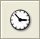
 | Returns the current time (string).                 |
        | TimGetDate          | 
 

 | Returns the current date (string).                 |
        | TimGetFormattedTime | 
 

 | Returns a string that contains the formatted time. |
        | TimGetFormattedDate | 
 

                                                                        | Returns a string that contains the formatted date. |

        \

    25. #### _‌Synchronize Library‌_

        \

        _The synchronize library is used to handle critical sections in methods._

        _The “SynLib” Prefix has been removed on some commands for a better overview._

        \

        | Command                      | Icon                                                                                                                                                               | Action Performed                                                                                                                 |
        | ---------------------------- | ------------------------------------------------------------------------------------------------------------------------------------------------------------------ | -------------------------------------------------------------------------------------------------------------------------------- |
        | SynInitializeCriticalSection | 
 

 | This function initializes a critical section object.                                                                             |
        | SynEnterCriticalSection      | 
 

 | Waits for ownership of the specified critical section object. The function returns when the calling thread is granted ownership. |
        | SynLeaveCriticalSection      | 
 

                                                                                         | Releases ownership of the specified critical section object.                                                                     |
        | Connect                      | 
 

                                                                                         | Opens a connection to another computer in a network. Every computer gets its own connection.                                     |
        | CloseConnection              | 
 

                                                                                         | Closes the connection with the specific SyncHandle.                                                                              |
        | SendData                     | 
 

                                                                                         | Sends the string in the variable DataToSend to the connection with the specific SyncHandle.                                      |
        | GetReceivedData              | 
 

                                                                                         | Reads data out of the local buffer from the specific SyncHandle.                                                                 |
        | GetAllReceivedData           | 
 

                                                                                         | Reads all data out of the local buffer from the specific SyncHandle.                                                             |
        | ResetBuffer                  | 
 

                                                                                         | Resets and clears the incoming data buffer from the specific SyncHandle.                                                         |
    26. #### _‌Tip Counting Library‌_

        \

        _The tip counting library provides all functions to store the available amount of tips for following methods. This is useful if a method does not use up all tips on the deck. After a new start of a method, the instrument will continue using the next available tip._

        _The “TipCount” Prefix has been removed for a better overview._

        \

        | Command | Icon                                                                                                                                                        | Action Performed                                                                                                                   |
        | ------- | ----------------------------------------------------------------------------------------------------------------------------------------------------------- | ---------------------------------------------------------------------------------------------------------------------------------- |
        | Write2  | 
 

 | Writes the indexes from the given sequence to the element counter database in the system directory.                                |
        | Read2   | 
 

 | Reads the indexes from the element counter database in the System directory into the given sequence.                               |
        | Edit2   | 
 

                                                                        | Reads the indexes from the element counter database into the given sequence and prompts the user to edit the sequence graphically. |

        \

    27. #### _‌Trace Library‌_

        \

        _The trace library allows using functions to write into the trace window._

        \

        | Command              | Icon                                                                                                                                                     | Action Performed                                                                                                        |
        | -------------------- | -------------------------------------------------------------------------------------------------------------------------------------------------------- | ----------------------------------------------------------------------------------------------------------------------- |
        | TrcFormatTrace       | 
 

 | Function to trace 2 formatted strings.                                                                                  |
        | TrcFormatTrace4      | 
 

 | Function to trace 4 formatted strings.                                                                                  |
        | TrcFormatTrace8      | 
 

 | Function to trace 8 formatted strings.                                                                                  |
        | TrcFormatTrace12     | 
 

 | Function to trace 12 formatted strings.                                                                                 |
        | TrcGetMethodFileName | 
 

 | Retrieves the path and name of the topmost HSL source file that includes the current HSL source file.                   |
        | TrcInputBox          | 
 

 | Displays the input request prompt in a dialog box and returns with the value of the specified type entered by the user. |
        | TrcMessageBox        | 
 

 | Displays a message in a message box and returns with a value, which identifies the button selected by the user.         |
        | TrcTrace             | 
 

 | Trace function with two arguments.                                                                                      |
        | TrcTrace4            | 
 

 | Trace function with four arguments.                                                                                     |
        | TrcTrace8            | 
 

 | Trace function with eight arguments.                                                                                    |

        | Command          | Icon                                                                                                                                                     | Action Performed                             |
        | ---------------- | -------------------------------------------------------------------------------------------------------------------------------------------------------- | -------------------------------------------- |
        | TrcTrace12       | 
 

 | Trace function with twelve arguments.        |
        | TrcTraceSequence | 
 

                                                                           | Traces the attributes of the given sequence. |

        \

    28. #### _‌Utility Library‌_

        \

        _The utility library is a collection of several useful commands to perform requests and more. The “Util” Prefix has been removed for a better overview._

        | Command                 | Icon                                                                                                                                                                       | Action Performed                                                                                       |
        | ----------------------- | -------------------------------------------------------------------------------------------------------------------------------------------------------------------------- | ------------------------------------------------------------------------------------------------------ |
        | Abs                     | 
 

                   | Returns a value of the same type that is passed to it specifying the absolute value of a number.       |
        | AddCheckSum             | 
 

                   | Computes the checksum of the specified file and writes the checksum value to the end of the file.      |
        | AsyncShell              | 
 

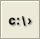
            | Runs an executable (exe, com, bat). This function runs other programs asynchronously.                  |
        | GetBarcodeJoker         | 
 

                   | Returns the value for the barcode joker mapped to the given key (string).                              |
        | GetEmailAddressOfSender | 
 

 | Get configured sender address for e-mails to be transmitted.                                           |
        | GetHWnd                 | 
 

                   | Returns the application’s main window handle.                                                          |
        | GetIVDSystem            | 
 

                   | Retrieves the IVD system installed flag from the system registry (integer).                            |
        | GetLanguage             | 
 

                   | Retrieves the Phoenix language.                                                                        |
        | GetSMTPServerHostName   | 
 

 | Request the configured SMTP server host name.                                                          |
        | GetSimulationMode       | 
 

                   | Returns the simulation mode (0 = simulation off, 1 = full simulation)                                  |
        | GetTimeScaleFactor      | 
 

                   | Returns the current time scale factor for activities/task durations (float; defaults to 1.0).          |
        | GetTimerViewName        | 
 

                   | Returns the view name of the given timer.                                                              |
        | GetUniqueRunId          | 
 

                   | Returns the unique ID of the current run.                                                              |
        | GetUserName             | 
 

                   | Retrieves the name of the current user. This is the name of the user currently logged onto the system. |

        | Command                | Icon                                                                                                                                                                       | Action Performed                                                                                                                                                                                            |
        | ---------------------- | -------------------------------------------------------------------------------------------------------------------------------------------------------------------------- | ----------------------------------------------------------------------------------------------------------------------------------------------------------------------------------------------------------- |
        | IsFloat                | 
 

                   | Returns true if the variable var is a float.                                                                                                                                                                |
        | IsInteger              | 
 

                   | Returns true if the variable var is an integer.                                                                                                                                                             |
        | IsNegative             | 
 

                   | Returns true if number is negative.                                                                                                                                                                         |
        | IsNumber               | 
 

                   | Returns true if the variable var is a numeric expression.                                                                                                                                                   |
        | IsString               | 
 

                   | Returns true if the variable var is a string.                                                                                                                                                               |
        | Lock                   | 
 

                   | Lock() and Unlock() are functions that enclose a series of HSL statements so that a group of HSL statements can be executed without interruption.                                                           |
        | Lookup                 | 
 

                   | Returns true if the array of variables contains the specified value, and if true, the parameter contains the index in the array of the found element.                                                       |
        | Max                    | 
 

                   | Returns the greater of two expressions (numeric or string).                                                                                                                                                 |
        | Min                    | 
 

                   | Returns the lower of two expressions (numeric or string).                                                                                                                                                   |
        | Pause                  | 
 

                   | Suspends the program execution at the next position where the Lock() and Unlock() functions match exactly.                                                                                                  |
        | RegisterAbortHandler   | 
 

                   | Registers abortHandler as a custom HSL function called before a method will be aborted. One or more abort handlers can be registered.                                                                       |
        | SendEMail              | 
 

                                                                                                 | Send an e-mail through an SMTP server.                                                                                                                                                                      |
        | SetEMailAdressOfSender | 
 

 | Overwrite configured sender address for e-mails to be transmitted.                                                                                                                                          |
        | SetSMTPServerHostName  | 
 

                                                                                                 | Overwrite configured SMTP server host name.                                                                                                                                                                 |
        | SetTimeScaleFactor     | 
 

                   | Sets the current time scale factor (float; defaults to 1.0). If the simulation mode is switched on, the time scale factor is used to scale task dependencies and activity durations                         |
        | SetTimerViewName       | 
 

                   | Sets the view name of the given timer.                                                                                                                                                                      |
        | Sort                   | 
 

                   | 
This sort algorithm acts on so called associative arrays (hash), which are built by two arrays.

One array contains the keys, the other the corresponding values. This function sorts the keys.
 |

        | Command                | Icon                                                                                                                                                     | Action Performed                                                                                                                                  |
        | ---------------------- | -------------------------------------------------------------------------------------------------------------------------------------------------------- | ------------------------------------------------------------------------------------------------------------------------------------------------- |
        | SyncShell              | 
 

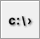
                                                                               | Runs an executable (exe, com, bat). This function runs other programs synchronously.                                                              |
        | Unlock                 | 
 

 | Lock() and Unlock() are functions that enclose a series of HSL statements so that a group of HSL statements can be executed without interruption. |
        | UnregisterAbortHandler | 
 

 | Unregisters abortHandler as a custom HSL function called before a method will be aborted                                                          |
        | VerifyCheckSum         | 
 

 | Verifies the checksum value of the specified file.                                                                                                |

        \

    29. #### _‌Utility Library 2‌_

        \

        _The HSL utility library 2 is an extension library to the core HSL utility library._

        _The “Util2:”, “Util2: Debug” and “Util2: Error” Prefixes have all been removed for a better overview._

        \

        | Command                       | Icon                                                                                                                                                     | Action Performed                                                                                                                                                              |
        | ----------------------------- | -------------------------------------------------------------------------------------------------------------------------------------------------------- | ----------------------------------------------------------------------------------------------------------------------------------------------------------------------------- |
        | CheckValueType                | 
 

 | Checks a variable to be of a given type.                                                                                                                                      |
        | CheckValueRange               | 
 

 | Checks a variable to be in a given (open) range.                                                                                                                              |
        | CheckValueRangeMinMax         | 
 

 | Checks a variable to be in a given (closed) range.                                                                                                                            |
        | CheckValueTypeAndRange        | 
 

 | Checks a variable to be of a given type and to be in a given (open) range.                                                                                                    |
        | CheckValueTypeAndRange MinMax | 
 

 | Checks a variable to be of a given type and to be in a given (closed) range.                                                                                                  |
        | VarArrCheckIndex              | 
 

 | Generates a runtime error with detailed description if the index is invalid for the given variable array.                                                                     |
        | SeqArrCheckIndex              | 
 

 | Generates a runtime error with detailed description if the index is invalid for the given sequence array.                                                                     |
        | VarArrGetAt                   | 
 

 | Returns a copy of the array element at the given index and raises a runtime error with a detailed description if the specified index is invalid for the given variable array. |
        | SeqArrGetAt                   | 
 

 | Returns a copy of the array element at the given index and raises a runtime error with a detailed description if the specified index is invalid for the given sequence array. |
        | ToString                      | 
 

 | Returns a string that represents the value of a given variable.                                                                                                               |

        | Command                           | Icon                                                                                                                                                     | Action Performed                                                                                      |
        | --------------------------------- | -------------------------------------------------------------------------------------------------------------------------------------------------------- | ----------------------------------------------------------------------------------------------------- |
        | RoundVolume                       | 
 

 | Rounds the given volume to one decimal place.                                                         |
        | RoundVolumeUp                     | 
 

 | Rounds the given volume up to one decimal place.                                                      |
        | RoundVolumeDown                   | 
 

 | Rounds the given volume down to one decimal place.                                                    |
        | GetLabwarePosXYZ                  | 
 

 | Obtains the position of the given labware item from the Deck Layout using deck coordinates.           |
        | RaiseRuntimeError                 | 
 

 | Raises a runtime error.                                                                               |
        | RaiseRuntimeErrorInclPrevErrDe sc | 
 

 | Raises a runtime error with an error description that includes the description of the previous error. |
        | RaiseLast                         | 
 

 | Re-throws the current runtime error.                                                                  |
        | MakeHxResult                      | 
 

 | Returns an HxResult value given a major ID, a minor ID and an error code.                             |
        | TraceSequence                     | 
 

 | Traces the name, the indexes and all labware and position IDs of the given sequence.                  |
        | TraceSequenceAndData\_1           | 
 

 | Traces the given sequence and additional sequence data.                                               |
        | TraceSequenceAndData\_2           | 
 

 | Traces the given sequence and additional sequence data.                                               |
        | TraceSequencesAndData\_1          | 
 

 | Traces the given sequences and additional sequence data.                                              |
        | TraceSequencesAndData\_2          | 
 

 | Traces the given sequences and additional sequence data.                                              |
        | TraceArray                        | 
 

 | Traces the elements of the given array.                                                               |
        | TraceArray\_2                     | 
 

 | Traces the elements of the given arrays.                                                              |
        | TraceArray\_3                     | 
 

 | Traces the elements of the given arrays.                                                              |
        | TraceArray\_4                     | 
 

 | Traces the elements of the given arrays.                                                              |
        | SetTraceArraySettings             | 
 

                                                                               | Sets the current settings to trace multiple arrays.                                                   |
    30. #### _‌HHS Library‌_

        \

        _The HHS library provides several functions to control the HHS, such as shaking and heating settings. The functions can be integrated into standard methods of the ML STAR instrument._

        _To install the library execute the file “InstallHHSLibrary\_Vx.x.exe”. The file can be obtained from a local Hamilton Representative._

        _After confirming the installation of the addition, the heater shaker library will be installed automatically._

        \

        

        _NOTE_

        _The library requires the following Microsoft Package, which will be installed automatically during the setup procedure:_

        _Microsoft Visual C++ 2005 Redistributable Package (x86)._

        \

        | Command                | Icon                                                                                                 | Action Performed                                                                                                                                                                                                                                                                                                    |
        | ---------------------- | ---------------------------------------------------------------------------------------------------- | ------------------------------------------------------------------------------------------------------------------------------------------------------------------------------------------------------------------------------------------------------------------------------------------------------------------- |
        | Create Star Device     | 
 

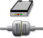
 | Creates the device number which must be used as input parameter for each function of this library.                                                                                                                                                                                                                  |
        | Create USB Device      | 
 

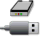
       | Creates the device number which must be used as input parameter for each function of this library.                                                                                                                                                                                                                  |
        | Terminate              | 
 

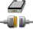
 | The connection to the ML STAR instrument and/or USB device is terminated. Note that this function does not stop the heating or shaking process of the heater shaker.                                                                                                                                                |
        | Start Shaker           | 
 

 | This function starts the shaking process. If necessary, the heater shaker will be initialized. Before the shaking process is started, the plate is locked. Shaking has to be stopped by the “Stop Shaker” Command. Terminating the connection will not stop shaking. However, shaking is stopped upon method abort. |
        | Start All Shaker       | 
 

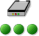
 | Start shaking on all initialized shakers. Shakers that have not been initialized are not addressed. The plates are locked before the shaking process.                                                                                                                                                               |
        | Start Shaker Timed     | 
 

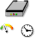
 | 
Start shaking for an indicated time. If necessary, the heater shaker will be initialized. Before the shaking process is started, the plate is locked.

After shaking, the plate lock has to be opened with the “SetPlateLock” Function.
                                                                 |
        | Start All Shaker Timed | 
 

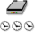
 | Start shaking on all initialized heater shakers for an indicated time. The plates are locked before the shaking process. After shaking, the plate lock has to be opened with the “SetPlateLock” Function.                                                                                                           |

        | Command                   | Icon                                                                                                 | Action Performed                                                                                                                                                                                                                                                                                         |
        | ------------------------- | ---------------------------------------------------------------------------------------------------- | -------------------------------------------------------------------------------------------------------------------------------------------------------------------------------------------------------------------------------------------------------------------------------------------------------- |
        | Wait For Shaker           | 
 

 | Wait for the heater shaker to finish. The plate is unlocked after shaking has been stopped. This command is only used in combination with “Start Shaker Timed” or “Start All Shaker Timed”.                                                                                                              |
        | Stop Shaker               | 
 

 | Stop shaking and unlock plate.                                                                                                                                                                                                                                                                           |
        | Stop All Shaker           | 
 

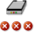
 | Stop shaking on all heater shakers. The plates will be unlocked subsequently.                                                                                                                                                                                                                            |
        | Set shaker parameter      | 
 

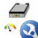
 | Set shaking parameters, such as shaking direction, shaking speed and acceleration.                                                                                                                                                                                                                       |
        | Get Shaker Parameter      | 
 

 | Get shaking parameters, such as shaking direction, shaking speed and acceleration.                                                                                                                                                                                                                       |
        | Start Temp Control        | 
 

 | Start temperature control on the heater shaker (must be greater than ambient temperature plus 5°C). Temperature control has to be stopped by the “Stop Temp Control” Function or will be constantly on. Terminating the connection will not stop heating. However, heating is stopped upon method abort. |
        | Wait for Temp Control     | 
 

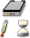
 | Wait until the heater shaker has reached the set temperature. This function will wait until the defined temperature is reached and is stable for 180 seconds. Only then, the method will continue.                                                                                                       |
        | Stop Temp Control         | 
 

 | Stop temperature control of the heater shaker.                                                                                                                                                                                                                                                           |
        | Get Temperature           | 
 

 | Receive the current temperature of the heater shaker.                                                                                                                                                                                                                                                    |
        | Set Temperature Parameter | 
 

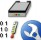
 | Set parameters for temperature control. In most cases, the default settings can be used and this function is not needed.                                                                                                                                                                                 |
        | Get Temperature Parameter | 
 

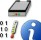
 | Receive the parameters for temperature control.                                                                                                                                                                                                                                                          |
        | Get Temperature State     | 
 

 | Get the status of the temperature control. The temperature should be within a defined temperature range.                                                                                                                                                                                                 |
        | Send Firmware Command     | 
 

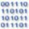
 | Send a firmware command to the heater shaker.                                                                                                                                                                                                                                                            |

        | Command              | Icon                                                                                                 | Action Performed                                                                                                                                                                                                                                                                                                                                                               |
        | -------------------- | ---------------------------------------------------------------------------------------------------- | ------------------------------------------------------------------------------------------------------------------------------------------------------------------------------------------------------------------------------------------------------------------------------------------------------------------------------------------------------------------------------ |
        | Set Plate Lock       | 
 

 | Open or close the plate lock. The plate is always locked automatically before shaking is started, but this command is useful to position and fix the plate in the center of the flat bottom adapter before pipetting, or when using the commands “Start Shaker Timed” or “Start All Shaker Timed” as these commands do not open the plate lock after shaking.                  |
        | Set Simulation       | 
 

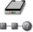
 | Set run mode to simulation for all functions in this library. In simulation mode, no signals are sent to the HHS.                                                                                                                                                                                                                                                              |
        | Set USB Trace        | 
 

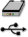
 | Turn on/off tracing of communication to and from USB port.                                                                                                                                                                                                                                                                                                                     |
        | Begin Monitoring     | 
 

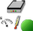
       | Start to monitor the performance of the HHS. This function monitors the temperature and speed in the background. The tolerated range of the temperature can be set with the function “SetTempParameter”. The tolerated range of speed is defined in this function. The status of the temperature can be requested in a defined interval and is then written to the trace file. |
        | End Monitoring       | 
 

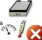
       | Get the shaking speed of a HHS.                                                                                                                                                                                                                                                                                                                                                |
        | Get Shaker Speed     | 
 

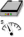
       | Get the shaking speed of a HHS.                                                                                                                                                                                                                                                                                                                                                |
        | Get Serial Number    | 
 

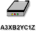
       | Get the serial number a HHS.                                                                                                                                                                                                                                                                                                                                                   |
        | Get Firmware Version | 
 

       | Get the firmware version of a HHS.                                                                                                                                                                                                                                                                                                                                             |
    31. #### _‌HSL VacuumBrandPump / ML STAR BVS Library‌_

        \

        _The ML STAR BVS Library allows controlling up to four BVS / CVS units simultaneously. There are two categories of functions provided:_

        _High Level Functions_

        _The high level functions control the whole vacuum process including tracking of the vacuum action to the Hamilton Database._

        _The use of HighLevelFunctions is recommended. High level functions have the prefix HSLStarBVSLib._

        \

        

        _NOTE_

        _The BVS Library can also be used for CVS._

        \

    32. #### _‌Low Level Functions‌_

        \

        _These functions reflect the command set of the “BVS pump controller” directly. These commands are old and are not recommended to be used anymore._

        _Low level functions have the prefix HSLVacuuBrandPump._

        \

        | Command               | Icon                                                                                                                                                              | Action Performed                                                                                             |
        | --------------------- | ----------------------------------------------------------------------------------------------------------------------------------------------------------------- | ------------------------------------------------------------------------------------------------------------ |
        | BVSAbort              | 
 

                                                                                | This function is used to stop all pump units and shut down their connections in an abort handler.            |
        | BVSGetAmbientPressure | 
 

 | Returns the ambient pressure measured with the specified pump unit.                                          |
        | BVSGetSimulationMode  | 
 

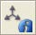
  | Returns whether simulation mode is set for the specified BVS / CVS or not.                                   |
        | BVSInitialize         | 
 

         | Initializes the connection to the specified BVS / CVS.                                                       |
        | BVSSetSimulationMode  | 
 

  | Sets the specified BVS / CVS to simulation mode.                                                             |
        | BVSTerminate          | 
 

          | Closes the connection to the specified BVS / CVS.                                                            |
        | BVSTrack              | 
 

              | Tracks a BVS / CVS volume move to the database.                                                              |
        | BVSVacuum             | 
 

             | Runs the vacuum process on the specified BVS / CVS.                                                          |
        | BVSVacuumTrack        | 
 

        | 
Runs the vacuum process on the specified BVS / CVS.

The volume move is tracked to the Database.
 |

        | Command                | Icon                                                                                                                                                               | Action Performed                                                                                                                                                              |
        | ---------------------- | ------------------------------------------------------------------------------------------------------------------------------------------------------------------ | ----------------------------------------------------------------------------------------------------------------------------------------------------------------------------- |
        | Initialize             | 
 

        | Using this function the communication port will be initialized. The pumping unit will be requested for errors to ensure the communication works.                              |
        | OpenAirAdmittanceValve | 
 

 | Allows opening the air admittance valve.                                                                                                                                      |
        | ReqActualPressure      | 
 

      | Requests the actual pressure in the system and the measured value will be returned.                                                                                           |
        | StartPressureControl   | 
 

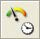
   | Prepares the pumping control unit for a pressure controlled execution of the pump and starts the pump.                                                                        |
        | StopPumpImmediately    | 
 

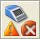
    | 
A running pump started with the function StartPressureControl() can be stopped immediately

at any time calling this function.
                                    |
        | Terminate              | 
 

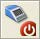
              | Releases system resources occupied by the function Initialize().                                                                                                              |
        | WaitForPumpStopped     | 
 

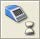
     | This function allows synchronization of pumping action and other actions which can be executed after the pump was started with a call of the function StartPressureControl(). |

        \

        

        _NOTE_

        _Do not mix high level functions and low level functions in the same method. Make sure to specify the library name._

        \

    33. #### _‌Vector Database Tracking Library‌_

        \

        _The HSL database tracking library allows accessing and manipulating tracking data in the database._

        _The prefixes “VectorDB\_Deck:”, “VectorDB\_Labware:”, “VectorDB\_LabwareType:”, “VectorDB\_Run:”, “VectorDB\_Experiment:” and “VectorDB\_TrackAction:” have all been removed for a better overview._

        \

        | Command                    | Icon                                                                                                                                                             | Action Performed                                                          |
        | -------------------------- | ---------------------------------------------------------------------------------------------------------------------------------------------------------------- | ------------------------------------------------------------------------- |
        | AssignLabwareToJob         | 
 

 | Assigns the given job to the given labware.                               |
        | AssignLoadedLabware ToJobs | 
 

 | Assigns labware loaded on given deck to corresponding 'Unprocessed' jobs. |
        | GetDeckID                  | 
 

 | Retrieves the deck ID given an instrument name.                           |
        | GetDeckID2                 | 
 

 | Retrieves the deck ID given an instrument.                                |

        | Command                               | Icon                                                                                                                                                             | Action Performed                                                                                 |
        | ------------------------------------- | ---------------------------------------------------------------------------------------------------------------------------------------------------------------- | ------------------------------------------------------------------------------------------------ |
        | GetAllLabwareOnDeck                   | 
 

 | Retrieves all loaded labware given a deck ID.                                                    |
        | IsLabwareLoaded                       | 
 

 | Returns the ID of the labware if the labware is loaded at the given position on the given deck.  |
        | IsLabwareLoadedByLabwareIdPo sitionId | 
 

 | Returns the ID of the labware if the labware is loaded at the given position on the given deck.  |
        | IsBarcodeLoaded                       | 
 

 | Returns the ID of the labware with the given barcode if the barcode is loaded on the given deck. |
        | GetElementID                          | 
 

 | Retrieves the ElementID given a labware access name.                                             |
        | GetElementIDByDeckIDLabwareI d        | 
 

 | Retrieves the ElementID for the given labware and deck.                                          |
        | GetElementIDByDeckIDLabwareI d        | 
 

 | Retrieves the ElementID for the given labware and deck.                                          |
        | GetLabwareLoadingTime                 | 
 

 | Retrieves the labware loading time given a labware access name.                                  |
        | GetLabwareLoadingTimeByElem entID     | 
 

 | Retrieves the labware loading time on given deck for given labware.                              |
        | GetLabware                            | 
 

 | Retrieves labware details information given a labware access name.                               |
        | GetLabwareByElementID                 | 
 

 | Retrieves labware details information given an element ID.                                       |
        | GetLabwareBarcode                     | 
 

 | Retrieves the barcode given a labware access name.                                               |
        | GetLabwareBarcodeByElementID          | 
 

 | Retrieves the barcode given an element ID.                                                       |
        | GetLabwareVolume                      | 
 

 | Retrieves the volume given a labware access name.                                                |
        | GetLabwareVolumeByElementID           | 
 

 | Retrieves the volume given an element ID.                                                        |
    34. #### _‌Vector Database Worklist Management Library‌_

        \

        _The HSL vector database worklist management library allows accessing and manipulating worklist data in the vector database._

        _The “VectorDB” Prefix has been removed for a better overview._

        \

        | Command                              | Icon                                                                                                                                                             | Action Performed                                                                                  |
        | ------------------------------------ | ---------------------------------------------------------------------------------------------------------------------------------------------------------------- | ------------------------------------------------------------------------------------------------- |
        | AddJob                               | 
 

 | Adds a new job to the vector database.                                                            |
        | AddJobAdditionalData                 | 
 

 | Adds additional data for the specified job to the vector database.                                |
        | RemoveJob                            | 
 

 | Removes the specified job from the vector database.                                               |
        | RemoveJobAdditionalData              | 
 

 | Removes additional data for the specified job from the vector database.                           |
        | RemoveAllJobs                        | 
 

 | Removes all jobs (including additional data) that match the given state from the vector database. |
        | GetJobs                              | 
 

 | Returns information about all jobs in the vector database that match the given job state.         |
        | GetJobIDs                            | 
 

 | Returns all job IDs that match the given filter in the given sort order.                          |
        | GetJob                               | 
 

 | Returns information about the specified job from the vector database.                             |
        | GetJobAdditionalData                 | 
 

 | Returns information about the additional data for the specified job from the vector database.     |
        | GetJobsSortedByPriority              | 
 

 | Returns information about all jobs in the vector database that match the given criteria.          |
        | GetJobsForLabware                    | 
 

 | Returns information about all jobs in the vector database that match the given criteria.          |
        | GetJobsForLabware SortedByPriority   | 
 

 | Returns information about all jobs in the vector database that match the given criteria.          |
        | GetJobsForBarcode                    | 
 

 | Returns information about all jobs in the vector database that match the given barcode criteria.  |
        | GetJobsForBarcode SortedByPriority   | 
 

 | Returns information about all jobs in the vector database that match the given priority criteria. |
        | GetJobsForElementID                  | 
 

 | Returns information about all jobs in the vector database that match the given element criteria.  |
        | GetJobsForElementID SortedByPriority | 
 

 | Returns information about all jobs in the vector database that match the given criteria.          |
        | GetJobState                          | 
 

 | Gets the state of the specified job from the vector database.                                     |

        | Command                | Icon                                                                                                                                                             | Action Performed                                                  |
        | ---------------------- | ---------------------------------------------------------------------------------------------------------------------------------------------------------------- | ----------------------------------------------------------------- |
        | SetJobState            | 
 

 | Sets the state of the specified job in the vector database.       |
        | RemoveJobsForLabware   | 
 

 | Removes information about all jobs that match the given criteria. |
        | RemoveJobsForBarcode   | 
 

 | Removes information about all jobs that match the given criteria. |
        | RemoveJobsForElementID | 
 

 | Removes information about all jobs that match the given criteria. |

        \

    35. #### _‌Data Handling Steps‌_

        \

        _Data handling steps are standard procedures for data and file handling._

        _The data handling steps have to be activated by clicking on “Method  Instrument and Smart Steps…”_

        \

        | Command             | Icon                                                                                                                                                             | Action Performed                                                              |
        | ------------------- | ---------------------------------------------------------------------------------------------------------------------------------------------------------------- | ----------------------------------------------------------------------------- |
        | GenerateMappingFile | 
 

                                                                                       | Creates mapped report file(s) for labware within a method run.                |
        | SetLabwareBarcode   | 
 

 | Set the barcode for a labware within the sample tracking database.            |
        | RemoveLabware       | 
 

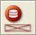
     | Removes labware from the access of sample tracking.                           |
        | ImportWorklist      | 
 

    | Imports worklist data from files into the vector database.                    |
        | UpdateJobStatus     | 
 

   | Set the job status of a sample contained in the worklist data to ‘Processed’. |

\

