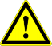
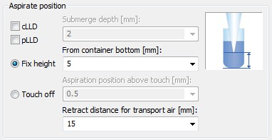

# Aspirating

For aspiration, three modes are available:

* “Aspiration”, for all standard cases.
* “Consecutive Aspiration” for aspiration with a tip that has already aspirated liquid (e.g. if aspirating out of three different containers before the dispense step).
* “Aspirate All” for aspiration of all the liquid in a container (specify a volume larger than what is expected to be in the container). In this case, aspiration monitoring is deactivated and the tip will follow the falling liquid level (if specified) to the bottom of the container, staying there for the rest of the aspiration.

Height

The most important condition for a successful aspiration is to make sure that the tip dips into the liquid. Another important point is to prevent the tip from withdrawing from the liquid during the complete aspiration step.

To make a good contact between the tip and the liquid, the positioning modes are available:

### 1. Fixed height

For the fixed height, a value must be chosen which ensures that the tip is permanently below the liquid level. The programmer must prevent aspiration of air instead of liquid.

### 2. Liquid Level Detection, LLD

Vigorously and with more care, the liquid level of the vessel to be aspirated from can be detected. This can be provided by the Microlab STAR Liquid Level Detection (LLD) feature based on either capacitive (cLLD) or pressure (pLLD) signal detection.

Depth

### Submerge Depth

Once the liquid surface is detected, an additional immersion depth of 2mm (specified by default) is used to prevent the aspiration of air.

### ‌Following the Liquid Level

The tip follows the decreasing liquid level (specified by default) according to the aspirated volume. The distance covered while following the liquid level is computed from the known geometry of the liquid container.

Air Gaps

## Blow out air

The first step within an aspiration and dispense cycle is to aspirate a variable amount of “blow-out” air, which is used at the end of the (last) dispense, to blow all the liquid out of the tip. This is done with the tips still in the air.

## Transport Air

After pulling out of the liquid and before moving to the target container, a variable amount of transport air is aspirated to prevent droplet formation.

At the end of an aspiration step the situation in the tip is as shown below.

When using a fixed height aspiration (or dispense), the position of the transport air intake can be defined by the parameter “Retract distance for transport air”. Using this value makes sure that the tip’s end is out of liquid before aspirating the transport air.

Speed

### Swap Speed

In order to prevent droplets at the tip/needle orifice, the pipetting channel is moving at a slow speed out of the liquid.

