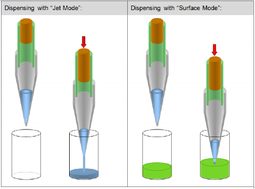

# Dispensing

At the end of the aspiration step, transport air has been aspirated. The first step of the dispensing procedure is to search for the liquid surface or to move to a fixed height.

<figure><figcaption></figcaption></figure>

* In order to ensure that the specified accuracy is achieved, volumes below 20µl should always be dispensed onto or into a (liquid) surface. For dispensing at liquid surface, use cLLD to detect the position of the surface and then dispense while following the rising liquid level.
* When the liquid level is known, dispensing from a fixed height while following the rising liquid level is also possible.
* For volumes larger than 20µl, the liquid can be dispensed in a jet without touching the surface. To dispense in a jet, specify a position a few millimeters above the surface and dispense following the rising liquid level. For dispensing in a jet low volume, a varying amount of blow- out air is used to make sure that all liquid is dispensed from the tip.
* If only a part of the liquid is dispensed with the jet mode, a stop back volume can be aspirated at the end of the dispense action. This will improve the droplet cut-off at the end of each dispense. In the last step of the dispense procedure, before any x- or y-movement occurs, a variable amount of transport air is aspirated to prevent droplet formation. The transport air is aspirated with the tip above the liquid surface.

## Dispensing of the liquid may occur with three different modes:

1. **Either onto/into a (liquid) surface**

Surface Part Volume

The “Surface Part Volume” Dispensing Mode works as follows:

1. When the target well is reached, the pipetting channel starts searching for the liquid surface (cLLD).
2. At an immersion depth of 2 mm (default setting), transport air and liquid (part volume) are dispensed.
3. The pipetting channel moves with swap speed to a distance of 5mm (default retract distance) above liquid level.
4. Aspiration of the transport air.

Surface Empty Tip

The “Surface Empty Tip” Dispensing Mode works as follows:

1. When the target well is reached, the pipetting channel starts searching for the liquid surface (cLLD).
2. At an immersion depth of 2 mm (default setting), transport air and liquid are dispensed while the pipetting channel is moving up in z-direction (following the liquid level).
3. The complete liquid and blow out volume is dispensed: empty tip.
4. The pipetting channel out of the liquid using swap speed, then the aspiration of transport air follows.

2. **In a free jet**

Jet Part Volume

The “Jet Part Volume” Dispensing Mode works as follows:

1. When the target well is reached, the pipetting channel starts to move to the fixed height (dispensing height).
2. At the dispensing height the transport air and liquid (part volume) are dispensed while the pipetting channel is moving up in z-direction (following the liquid level).
3. The pipetting channel moves up.
4. Aspiration of the transport air.

Jet Empty Tip

The “Jet Empty Tip” Dispensing Mode works as follows:

1. When the empty target well is reached, the pipetting channel moves to a fixed height (e.g. 2 mm above the bottom of the well).
2. Transport air and liquid are dispensed while the pipetting channel is moving up in z-direction (following the liquid level).
3. The blow out volume is dispensed: empty tip.
4. The pipetting channel moves up, and then the aspiration of transport air follows.

3. Onto the side of the well

Touch Off

The “Touch off” Function is used if very small amounts of liquid shall be aspirated or dispensed into a manually placed labware or labware with great tolerances. The “Touch off” Function will move to a certain height over the well bottom and smoothly move downwards. As soon as the tip hits the bottom of the container, the motor current of the z-drive increases. This change will be detected and the z-move stops. From that position, the pipetting channels moves back up the specified distance “Dispense position above touch” and starts dispensing.

\

Side Touch

For a small amount of liquid, there is the possibility of dispensing liquid to the side of the well with the “Side touch” Mode (available in the Single Steps / Easy Steps).

The “Side touch” Mode will move the tip to a specified height in the center of the container, and then moves right (always right). At this position, the dispensing of the liquid starts.

The values for “Touch off height” and “Right” move have to be defined in the container data in the Labware Editor.

