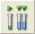
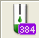

# Pipetting Steps

\

1.  #### _‌Smart Steps‌_

    \

    <table data-header-hidden><thead><tr><th width="584"></th><th></th><th></th></tr></thead><tbody><tr><td>ML_STAR Smart Steps</td><td></td><td></td></tr><tr><td>Command</td><td>Icon</td><td>Action Performed</td></tr><tr><td>1000μl Channel Tip Pick up</td><td>
 

</td><td>Pick up disposable tips from tip rack.</td></tr><tr><td>1000μl Channel Needle Pick up</td><td>
 

</td><td>Pick up needles from wash station (or racks).</td></tr><tr><td>1000μl Channel Pipette Simple (1-1)</td><td>
 

</td><td>Simple pipetting for simple aspiration/dispense cycle.</td></tr><tr><td>1000μl Channel Pipette Replica (1-n)</td><td>
 

</td><td>Pipetting for cycles of aspirations/dispenses where the liquid from one source is dispensed into multiple target containers (no aliquoting).</td></tr><tr><td>1000μl Channel Pipette Pooling (n-1)</td><td>
 

</td><td>Pipetting for cycles of multiple aspirations/dispenses where liquid from multiple source containers is dispensed into one target container.</td></tr><tr><td>1000μl Channel Pipette Aliquot</td><td>
 

</td><td>Pipetting for cycles with one aspiration followed by multiple dispenses.</td></tr><tr><td>1000μl Channel Tip Eject</td><td>
 

</td><td>Eject disposable tips into tip waste.</td></tr><tr><td>1000μl Channel Needle Eject</td><td>
 

</td><td>Release needles in racks or wash station (and start wash).</td></tr></tbody></table>

    \

2.  #### _‌Easy Steps‌_

    \

    _There are two Easy Steps for the pipetting channels, the CO-RE 96 Probe Head and the CO-RE 384 Probe Head:_

    * _Aspirate (including the pickup of disposable tips/needles)._
    * _Dispense (including the disposable tips/needles wash and eject)._

    _The Easy Steps are installed by default. These commands can be found in the “ML\_STAR” Toolbox Group._

    \

    | ML\_STAR Easy Steps     |                                                                                                          |                                                    |
    | ----------------------- | -------------------------------------------------------------------------------------------------------- | -------------------------------------------------- |
    | Command                 | Icon                                                                                                     | Action Performed                                   |
    | 1000μl Channel Aspirate | 
 

                        | Aspirate liquid with the 1000μl-pipetting channels |
    | 5ml Channel Aspirate    | 
 

                        | Aspirate liquid with the 5ml-pipetting channels    |
    | CO-RE 96 Head Aspirate  | 
 

 | Aspirate liquid with the CO-RE 96 Probe Head       |

    | ML\_STAR Easy Steps     |                                                                                    |                                               |
    | ----------------------- | ---------------------------------------------------------------------------------- | --------------------------------------------- |
    | Command                 | Icon                                                                               | Action Performed                              |
    | CO-RE 384 Head Aspirate | 
 

  | Aspirate liquid with the CO-RE 384 Probe Head |
    | 1000μl Channel Dispense | 
 

  | Dispense with the 1000μl-pipetting channels   |
    | 5ml Channel Dispense    | 
 

  | Dispense with the 5ml-pipetting channels      |
    | CO-RE 96 Head Dispense  | 
 

 | Dispense liquid with the CO-RE 96 Probe Head  |
    | CO-RE 384 Head Dispense | 
 

  | Dispense liquid with the CO-RE 384 Probe Head |

    _The default settings of the aspirate steps correspond to an ordinary aspiration “Simple Aspiration” mode. If any other aspiration mode (Consecutive, All), mix step, LLD setting, etc. is required, clicking the \[Customize…] Button can modify the command._

    \

    

    _The \[Error settings…] Dialog allows an error handling approach to be specified._

    \

3.  #### _‌Single Steps‌_

    \

    _If highest flexibility of the system is required, use the Single Step commands. When using these commands, even most complex liquid handlings can be programmed._

    \

    | 1000µl-Pipetting Channels            |                                                                                   |                                                                                                              |
    | ------------------------------------ | --------------------------------------------------------------------------------- | ------------------------------------------------------------------------------------------------------------ |
    | Command                              | Icon                                                                              | Action Performed                                                                                             |
    | 1000μl Channel Tip Pick Up           | 
 

 | Picks up a CO-RE tip or needle                                                                               |
    | 1000μl Channel Aspirate              | 
 

 | Aspirate liquid from a container                                                                             |
    | 1000μl Channel Dispense              | 
 

 | Dispense liquid into a container                                                                             |
    | 1000µl Channel Dispense on the Fly   | 
 

 | Pipettes liquid without stopping in x over a full plate or sequence. Very fast for e.g. reagent distribution |
    | 1000μl Channel Tip Eject             | 
 

 | Discards the tip into the tip waste or the needle into the wash station or rack                              |
    | 1000μl Channel Get Last Liquid Level | 
 

 | Gets the z-position of the last Liquid Level Detection                                                       |

    | 5ml Pipetting Channels            |                                                                                   |                                                                                                              |
    | --------------------------------- | --------------------------------------------------------------------------------- | ------------------------------------------------------------------------------------------------------------ |
    | Command                           | Icon                                                                              | Action Performed                                                                                             |
    | 5ml Channel Tip Pick Up           | 
 

 | Picks up a CO-RE tip or needle                                                                               |
    | 5ml Channel Aspirate              | 
 

 | Aspirates liquid from a container                                                                            |
    | 5ml Channel Dispense              | 
 

 | Dispenses liquid into a container                                                                            |
    | 5ml Channel Dispense on the Fly   | 
 

 | Pipettes liquid without stopping in x over a full plate or sequence. Very fast for e.g. reagent distribution |
    | 5ml Channel Tip Eject             | 
 

 | Discards the tip into the tip waste or the needle into the wash station or rack                              |
    | 5ml Channel Get Last Liquid Level | 
 

 | Gets the z position of the last Liquid Level Detection                                                       |

    \

    | CO-RE 96 Probe Head       |                                                                                                              |                                   |
    | ------------------------- | ------------------------------------------------------------------------------------------------------------ | --------------------------------- |
    | Command                   | Icon                                                                                                         | Action Performed                  |
    | CO-RE 96 Head Tip Pick Up | 
 

    | Pick up CO-RE tips                |
    | CO-RE 96 Head Aspirate    | 
 

                            | Aspirates liquid from a container |
    | CO-RE 96 Head Dispense    | 
 

 | Dispenses liquid into a container |
    | CO-RE 96 Head Tip Eject   | 
 

 | Discards the tips                 |

    \

    | CO-RE 384 Probe Head       |                                                                                   |                                    |
    | -------------------------- | --------------------------------------------------------------------------------- | ---------------------------------- |
    | Command                    | Icon                                                                              | Action Performed                   |
    | CO-RE 384 Head Tip Pick Up | 
 

 | Pick up CO-RE tips.                |
    | CO-RE 384 Head Aspirate    | 
 

 | Aspirates liquid from a container. |
    | CO-RE 384 Head Dispense    | 
 

 | Dispenses liquid into a container. |
    | CO-RE 384 Head Tip Eject   | 
 

 | Discards the tips.                 |

    | Nano Pipettor                     |                                                                                                             |                                                                                                     |
    | --------------------------------- | ----------------------------------------------------------------------------------------------------------- | --------------------------------------------------------------------------------------------------- |
    | Command                           | Icon                                                                                                        | Action Performed                                                                                    |
    | Nano Pipettor Aspirate            | 
 

             | Aspirates liquid from a container.                                                                  |
    | Nano Pipettor Dispense            | 
 

             | Dispenses liquid into a container.                                                                  |
    | Nano Pipettor Dispense On The Fly | 
 

          | Drops liquid into a sequence without reaspiration and without stopping the movement in x direction. |
    | Nano Pipettor Wash                | 
 

                 | Flush the ceramic tips and clean them in the Ultrasonic bath.                                       |
    | Nano Pipettor Prepare             | 
 

           | Primes the liquid system and flushs the pipettor or primes the pipettor only.                       |
    | Nano Pipettor Move To Position    | 
 

 | Moves the pipetting head to an absolute position, or to one relative to the current position.       |

    \

4.  #### _‌Process Control‌_

    \

    _For additional process control of the pipetting steps, the monitoring functions can be switched on and off for a single pipetting step or for a specific part of the method. The commands for the Monitored Air Displacement (MAD) and the Capacitive Clot Detection are functions of the library “HSLML\_STARLib”. To make the commands available, link the library to the method. Add the library to the method through the "Method  Libraries..._[_" Menu (refer to_ ](pipetting-steps.md#bookmark324)[_Section_ ](pipetting-steps.md#bookmark324)_11.12.10_[_ML STAR Library_](pipetting-steps.md#bookmark324)[_._](pipetting-steps.md#bookmark324)

    \

    | Process Control                          |                                                                                   |                                                                                                         |
    | ---------------------------------------- | --------------------------------------------------------------------------------- | ------------------------------------------------------------------------------------------------------- |
    | Command                                  | Icon                                                                              | Action Performed                                                                                        |
    | AntiDropletControl\_1000ulChannel\_On    | 
 

 | Activates the Anti-Droplet Control (ADC) on the 1000μl-pipetting channels.                              |
    | AntiDropletControl\_1000ulChannel\_Off   | 
 

 | Deactivates the Anti-Droplet Control (ADC) on the 1000μl-pipetting channels.                            |
    | AntiDropletControl\_5mlChannel\_On       | 
 

 | Activates the Anti-Droplet Control (ADC) on the 5ml-pipetting channels.                                 |
    | AntiDropletControl\_5mlChannel\_Off      | 
 

 | Deactivates the Anti-Droplet Control (ADC) on the 5ml-pipetting channels.                               |
    | AspirationMonitoring\_1000ulChannel\_Off | 
 

 | Disables the aspiration and clot detection monitoring with the ‘pLLD’ on the 1000μl-pipetting channels. |
    | AspirationMonitoring\_1000ulChannel\_On  | 
 

 | Enables the aspiration and clot detection monitoring with the ‘pLLD’ on the 1000μl-pipetting channels.  |

    | Process Control                             |                                                                                   |                                                                                                                                |
    | ------------------------------------------- | --------------------------------------------------------------------------------- | ------------------------------------------------------------------------------------------------------------------------------ |
    | Command                                     | Icon                                                                              | Action Performed                                                                                                               |
    | AspirationMonitoring\_5mlChannel\_Off       | 
 

 | Enables the aspiration and clot detection monitoring with the ‘pLLD’ on the 5ml-pipetting channels.                            |
    | AspirationMonitoring\_5mlChannel\_On        | 
 

 | Disables the aspiration and clot detection monitoring with the ‘pLLD’ on the 5ml-pipetting channels.                           |
    | ClotDetectionMonitoring\_1000ulChannel\_Off | 
 

 | Enables the clot detection monitoring with the ‘cLLD’ on the 1000μl-pipetting channels.                                        |
    | ClotDetectionMonitoring\_1000ulChannel\_On  | 
 

 | Disables the clot detection monitoring with the ‘cLLD’ on the 1000μl-pipetting channels.                                       |
    | ClotDetectionMonitoring\_5mlChannel\_Off    | 
 

 | Enables the clot detection monitoring with the ‘cLLD’ on the 5ml-pipetting channels.                                           |
    | ClotDetectionMonitoring\_5mlChannel\_On     | 
 

 | Disables the clot detection monitoring with the ‘cLLD’ on the 5ml-pipetting channels.                                          |
    | SetPressureThreshold\_1000ulChannel         | 
 

 | Sets the pressure threshold for the aspiration and clot detection monitoring with the ‘pLLD’ on the 1000μl-pipetting channels. |
    | SetPressureThreshold\_5mlChannel            | 
 

 | Sets the pressure threshold for the aspiration and clot detection monitoring with the ‘pLLD’ on the 5ml-pipetting channels.    |

    \

5.  #### _‌Using Smart Steps‌_

    \

    _In this section, the general features of the "Pipette" Smart Step are explained by means of the “Simple Pipetting” Smart Step (the other variants of the “Pipette_[_” Command have similar wizards). More examples can be found in_ ](pipetting-steps.md#bookmark360)_Section 12 Demo Methods for the ML STAR._

    1.  _Drag one of the "Pipette" Smart Steps into the method window. The corresponding step of the "Pipette" Smart Step Wizard opens:_

        

        \

    2. _Use the drop down list to identify the instrument on which pipetting must be performed, as well as the aspirate and dispense sequences._
    3.  _Note that the sequences can also be indicated using arrays:_

        \

        
    4.  _Click the \[Next >] Button. The next page of the pipetting wizard will be activated._

        \

        

        \

    5.  _Note that in this dialog the volume can also be specified using an array as shown below._

        \

        
    6. _Define: the volume(s) for the pipetting process, a possible rest volume and its re-dispense target._
    7. _If a volume for “Simple“, “Replica” or “Pooling” is specified and exceeds the volume of the tip, multiple transfers with equally divided volumes will be performed automatically._

    _Rest Volume_

    _A residual volume “Rest volume” in the dialogs may be used for all pipetting modes too. This is handled at the end of a pipetting step after the (last) dispensing step. In the aliquot mode the additional handled residual volume is called “Post-aliquot” in contrast to the “Pre-aliquot”, which is handled before the aspirating step. The pre-aliquot is dispensed back into the aspiration sequence._

    _With the “Rest volume”, the choice is to discard it back into the aspiration sequence, or to dispense it into the waste container. In the previous example, a re-dispense height counted from the bottom of the container has to be given._

    1.  _Click the \[Next >] Button. The following pipetting wizard dialog will be displayed._

        \

        

        \

    2. _Select the appropriate tip/needle handling which is the same for all dispense modes:_
    3. _First, select the tip sequence - where the tips are to be picked up from (here, an array can also be selected). The tip type is automatically retrieved from the sequence. If the tip sequence is used up, it will be automatically reloaded. As an additional feature, the tip sequence can be reduced during a reload._
    4. _Tip/needle handling can be specified, too (some items may not be selected, depending on the pipetting mode):_
       *   _Replace tips “After each dispense“ (if multiple dispenses are needed to transfer e.g. 900_

           _µl with a standard tip of 300 µl),_
       * _Only for replicas (and pooling) the option “After transferred volume“ becomes active. This allows the use of fresh tips even for multiple aspirations and multiple dispense cycles being performed with the same sample._
       * _“After each sample“ (multiple dispenses of the same sample are done with the same tip),_
       * _With “One tip set“, or_
       * _Without tip handling, “Never“. In this case, ML STAR will have to pick up tips prior to the pipette step and eject them after pipetting, using single steps._
    5. _A tip counter can be specified, which enables the user to start with a set of tips, partly used in previous runs at the correct position. To read a tip counter, it can be specified within the Smart Step “Load” (see corresponding section). A tip counter is specified by a name (e.g., “cntTips“). Be reminded to enclose the name in quotation marks._
    6. _Within the “Pipette” Smart Step, the current position of the tip sequence will continuously be stored under the name of the tip counter. Note that a tip counter has to be initialized if it is to be read by the “Load” Smart Step within the next run._
    7.  _Click the \[Next >] Button. The next page of the pipetting wizard will be displayed._

        \

        
    8. _Define the dispense mode and the liquid class._
    9. _Define the aspiration and dispense (liquid handling) parameters used in the step._
    10. _The “Aspirate the complete requested volume without an error“ Checkbox enables aspiration of the residual liquid from a container (specify a volume larger than the expected residual volume within the container) without an error, even if there is not enough liquid available._
        * _For dispense, select the “Surface“ or “Jet“Dispense Mode._
        *   _For aspiration and dispense, specify the LLD (Liquid Level Detection) settings by clicking the \[LLD] Button. Below is how the “Aspirate LLD” Screen should look like._

            \

            

            \

    11. _Within the LLD dialog, capacitance, pressure, both LLD types or none may be selected._
        * _A sensitivity setting is necessary. Either use the predefined settings from the Labware or override these settings with Very high / High / Medium or Low._
        * _If no LLD is used in aspiration and jet dispensing cannot work with LLD, the height from the bottom has to be defined._
        * _If any LLD is used either for aspiration or dispense, a submerge depth has to be specified. For the parallel use of both LLD types, only selectable for aspiration, a maximum height difference has to be given within which both LLDs have to respond._
    12. _Click \[OK], to close the “Aspirate LLD” Screen._
    13. _In the “Pipetting Wizard” Screen, click the \[Advanced...] Button, to specify the options “Pre- rinsing” and “Liquid following”. Below is how the “Dispense” Screen looks like. Click \[OK], to close the “Dispense” Screen._

        \

        

        \

    14. _Here in the “Channel Settings” Dialog, the user is allowed to specify a channel pattern manually, as well as the number of the channels which will be used to calibrate (1536-well) carriers._

        \

        
    15. _Click the \[Next >] Button. The last page of the pipetting wizard will be displayed._

        \

        

        \

    16. _Select the appropriate controlling sequence by activating the radio button. As long as both sequences are of the same length, this selection does not influence the pipetting (if no pipetting error occurs)._

    \

    _Sequence handling for Aliquot procedure_

    _In the case of aliquoting, the dispense sequence is always the controlling sequence._

    \

    _Sequence Handling in Pipetting Mode “Simple”_

    _Consider a situation where the aspiration sequence comprises 8 tubes, and the dispense sequence is a 96-well plate. What should be done now with the 88 remaining positions within the plate? If the aspiration sequence is controlling, the dispense sequence is reduced to the length of the aspiration sequence and the pipetting stops after dispensing into the first 8 positions of the plate sequence. If the dispense sequence is controlling, the aspiration sequence will be repeated until it reaches the length of the dispense sequence. This results in multiple transfers (12 for an 8- channel instrument) from the same 8 tubes to fill the complete plate. Then the (controlling) dispense sequence is finished and pipetting stops._

    

    _NOTE_

    _The “Pipette” Smart Step always equalizes the length of aspiration and dispense sequences._

    \

    _The following table gives an overview of the different situations and examples._

    \

    | 
 
                             | 
Aspiration sequence is GREATER THAN

dispense sequence
                                                                                                                                              | 
Aspiration sequence is SMALLER THAN

dispense sequence
                                                                                                                                                                                                                                               |
    | --------------------------------------- | --------------------------------------------------------------------------------------------------------------------------------------------------------------------------------------------------------------- | ---------------------------------------------------------------------------------------------------------------------------------------------------------------------------------------------------------------------------------------------------------------------------------------------------------------- |
    | 
 

Aspiration Controls
   | 
<a href="pipetting-steps.md#bookmark435">The dispense sequence is REPEATED to the length of aspiration sequence (see </a><a href="pipetting-steps.md#bookmark435">Case </a>1)

Examples for use:
    | 
<a href="pipetting-steps.md#bookmark437">The dispense sequence is REDUCED to the length of the aspiration sequence (see </a><a href="pipetting-steps.md#bookmark437">Case </a>3)

Example for use:

- Transfer a variable number (&#x3C;96) of tubes into a 96-well plate (left partly filled).
 |
    | 
 

Dispensation Controls
 | 
<a href="pipetting-steps.md#bookmark436">The aspiration sequence is REDUCED to the length of the dispense sequence (see </a><a href="pipetting-steps.md#bookmark436">Case </a>2)

Examples for use:
 | 
<a href="pipetting-steps.md#bookmark438">The aspiration sequence is REPEATED to the length of dispense sequence (see </a>Case 4)

Examples for use:
                                                                                                                                                  |

    * _Copy 2 plates into 1 (after another)_
    * _With reloading of the dispense sequence: Transfer available tubes to as many plates as needed._
    * _Transfers from many tubes to a plate and stops when plate is filled._
    * _With reloading of plate sequences: Automatically fill as many plates as needed with liquid from tubes._
    * _Transfer reagent from a container (or, e.g., 8 tubes) to a complete plate._
    * _Copy tubes repeatedly into plate._
    * _With reload of aspiration sequence: Automatically reload tubes until plate is filled._

    _‌Case 1: Aspiration sequence > dispense sequence, controlled by the aspiration sequence._

    \

    

    \

    _The target sequence is repeated to match the length of the source sequence._

    _Another example for this case: All Tubes to Plate(s). This is a reloadable plate sequence used to load all tubes to as many plates as needed._

    \

    _‌Case 2: Aspiration sequence > dispense sequence. This case is controlled by the dispense sequence._

    \

    

    \

    _The source sequence is cut to match the length of the target sequence, and stops when the plate is full (prepare plate for assay)._

    _‌Case 3: Dispense sequence > aspiration sequence this case is controlled by the aspiration sequence_

    \

    

    \

    _The target sequence is cut to match the length of the source sequence and stops when the tubes are processed (how many samples today?). If L(Sasp)>96, plate is filled again._

    \

    _‌Case 4: Dispense sequence > aspiration sequence. This case is controlled by the dispense sequence._

    \

    

    _The source sequence is repeated n-times to match the length of the target sequence and stops when the plate is full (distribute buffer, reagents...). Also used for aliquoting._
