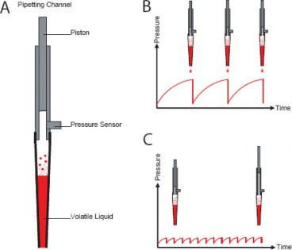

# Anti-Droplet Control (ADC)‌

_The Anti-Droplet Control (ADC) function offers a way to prevent droplet formation at the tip of tips or needles while pipetting highly volatile liquids._

_These liquids cause droplets because the high vapor pressure of the volatile solvents (e.g. acetone, ethanol, diethyl ether) results in a pressure increase in the tip. This pressure will push the liquid out of the tip (fig A and B)._

_The working principle of ADC is to measure the pressure inside the pipetting channel (with the built-in pressure sensor) and compensate the increasing pressure by moving the piston upwards. The evaporated volume of the liquid will now be compensated._\

<figure><figcaption>
<em>Anti-droplet control (ADC)</em>
</figcaption></figure>

<table data-header-hidden><thead><tr><th width="101"></th><th></th></tr></thead><tbody><tr><td></td><td>
<em>ATTENTION</em>

<em>The following statements will help in order to get best pipetting results using ADC:</em>
<ul><li><em>Use ADC only for pipetting steps where a change of pressure inside the tip is expected (e.g. if using a liquid with high vapor pressure).</em></li><li><em>The air transport volume should be very small or zero. If necessary, create a new liquid class.</em></li><li><em>The swap speed should be slow. If necessary, create a new liquid class.</em></li><li><em>Keep in mind that the piston may not be in its initial position when tips are reused without ejecting. ADC might not be working after several steps.</em></li></ul>
<em>ADC can be switched on using the appropriate steps from “HSLStarLib.hsl”. ADC works on both pipetting channel types, 1000μl and 5ml.</em>
</td></tr></tbody></table>

\
